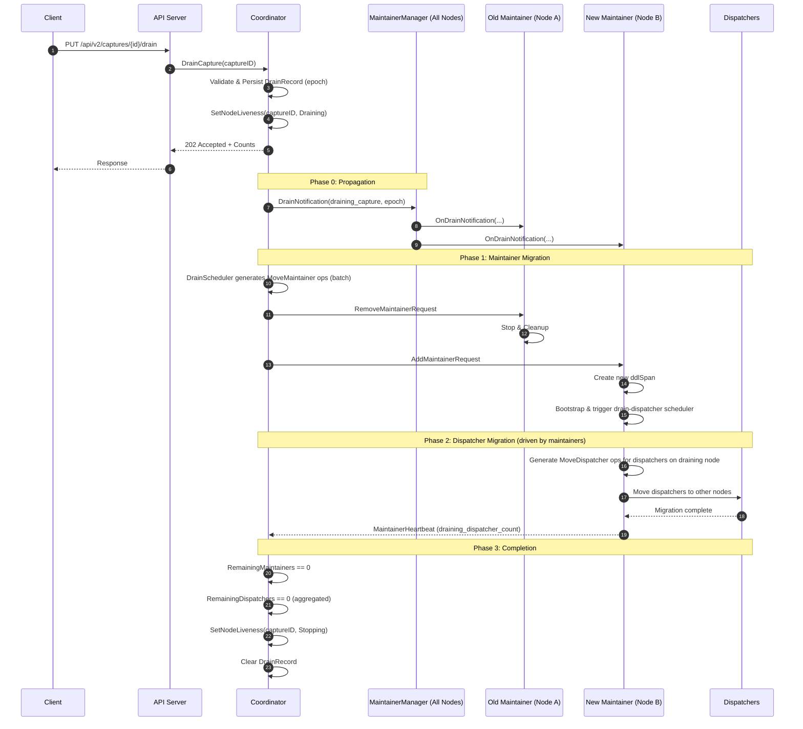
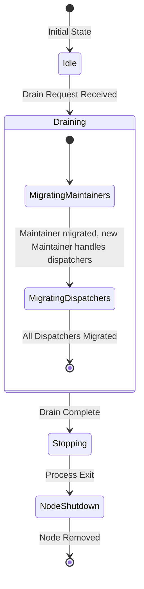

# Design Document: Drain Capture

## Overview

本设计文档描述了 TiCDC 新架构中 Drain Capture 功能的详细设计。该功能允许运维人员将指定节点上的所有工作负载（maintainers 和 dispatchers）迁移到其他节点，然后下线该节点，以便进行节点维护、升级或下线操作。

### 设计目标

1. **无中断迁移**：在不中断数据同步的情况下完成工作负载迁移
2. **两层迁移**：同时处理 Maintainer 层面和 Dispatcher 层面的迁移
3. **调度排除**：确保不会有新任务调度到正在被排空的节点
4. **节点下线**：drain 完成后节点自动进入 Stopping 状态并下线
5. **可观测性**：提供状态查询和监控能力

### 核心设计原则

#### 1. Maintainer 与 Table Trigger Dispatcher 的 1:1 绑定

在 TiCDC 新架构中，每个 Maintainer 都有一个关联的 Table Trigger Event Dispatcher (ddlSpan)，它们必须在同一节点上运行：

- ddlSpan 在 Maintainer 创建时绑定到 `selfNode.ID`
- 负责处理 DDL 事件，与 Maintainer 紧密协作
- 如果 Maintainer 迁移到新节点，ddlSpan 会在新节点自动重建

#### 2. Maintainer 先迁移，Dispatcher 自然跟随

基于上述约束，我们采用 **Maintainer 先迁移** 的策略：

1. Coordinator 迁移 Maintainer 到新节点
2. 新 Maintainer 启动时自动创建新的 ddlSpan
3. 新 Maintainer bootstrap 后发现有 dispatchers 在 draining 节点上
4. 新 Maintainer 自动生成 MoveDispatcher operators 迁移这些 dispatchers

这种设计的优势：
- **复用现有机制**：利用现有的 Maintainer 迁移和 bootstrap 机制
- **自然满足约束**：ddlSpan 随 Maintainer 迁移自动重建
- **简化状态管理**：不需要复杂的两阶段协调


### Liveness 状态扩展

扩展现有的 `Liveness` 类型，添加 `Draining` 状态：

```go
type Liveness int32

const (
    LivenessCaptureAlive    Liveness = 0  // 节点正常运行
    LivenessCaptureStopping Liveness = 1  // 节点正在优雅关闭
    LivenessCaptureDraining Liveness = 2  // 节点正在被排空（新增）
)
```

**Liveness 状态说明**：

| 状态 | 说明 | 触发方式 | 行为 |
|------|------|----------|------|
| Alive | 节点正常运行 | 默认状态 | 可接收新任务 |
| Draining | 节点正在被排空 | drain API 触发 | 不接收新任务，主动迁移现有任务 |
| Stopping | 节点正在关闭 | drain 完成或节点主动关闭 | 不接收新任务，等待进程退出 |

**Liveness 状态转换规则**：
```
Alive → Draining：通过 drain API 触发
Draining → Stopping：drain 完成（所有任务迁移完成）
Alive → Stopping：节点优雅关闭（非 drain 场景）
```

**注意**：`Draining` 状态是单向的，不能回到 `Alive`，因为 drain 的目标是下线节点。

### 并发迁移配置

支持可配置的 Maintainer 迁移并发度：

```go
type DrainConfig struct {
    // MaintainerBatchSize is the number of maintainers to migrate concurrently
    // Default: 1
    MaintainerBatchSize int `toml:"maintainer-batch-size" json:"maintainer-batch-size"`
}
```

- 默认并发度为 1，保守策略，确保稳定性
- 可根据集群规模和网络状况调整
- 每批次等待当前迁移完成后再开始下一批


## Architecture

### Drain 流程时序图



### 组件交互图

```mermaid
flowchart TD
    Client["Client"] -->|PUT /api/v2/captures/{id}/drain| API["API Server"]

    API --> FWD{"Is Coordinator?"}
    FWD -- "no" --> Proxy["Forward to Coordinator"]
    Proxy --> CoordAPI["Coordinator API Handler"]
    FWD -- "yes" --> CoordAPI

    CoordAPI --> Validate["Validate Request"]
    Validate --> SetDrain["Persist DrainRecord (epoch)"]
    SetDrain --> SetLiveness["Persist Node Liveness = Draining"]
    SetLiveness --> Response["Return 202 + Counts"]

    SetDrain --> DrainSched["Drain Capture Scheduler"]
    DrainSched --> GenMaintOps["Generate MoveMaintainer Operators (batch)"]
    GenMaintOps --> OpCtrl["Operator Controller"]

    SetDrain --> Notify["Broadcast DrainNotification"]
    Notify --> MaintMgr["MaintainerManager (All Nodes)"]

    OpCtrl --> RemoveOld["RemoveMaintainerRequest to Old Node"]
    OpCtrl --> AddNew["AddMaintainerRequest to New Node"]

    AddNew --> NewMaint["New Maintainer"]
    NewMaint --> CreateDDL["Create new ddlSpan"]
    CreateDDL --> Bootstrap["Bootstrap"]
    Bootstrap --> DrainDispSched["Drain-dispatcher scheduler"]
    DrainDispSched --> GenDispOps["Generate MoveDispatcher Operators"]
    GenDispOps --> DispMigrate["Dispatcher Migration"]
    DispMigrate --> Report["Report draining_dispatcher_count"]
    Report --> CoordAPI

    DispMigrate --> Complete["All Migrations Complete"]
    Complete --> SetStopping["Set Node Liveness = Stopping"]
    SetStopping --> ClearDrain["Clear DrainRecord"]
```


### 状态流转图



## Components and Interfaces

### 1. Liveness 扩展

```go
// pkg/node/node.go - 扩展 Liveness 类型

type Liveness int32

const (
    LivenessCaptureAlive    Liveness = 0
    LivenessCaptureStopping Liveness = 1
    LivenessCaptureDraining Liveness = 2  // 新增
)

// IsSchedulable returns true if the node can accept new workloads.
// Returns false if node is Draining or Stopping.
func (l *Liveness) IsSchedulable() bool {
    return l.Load() == LivenessCaptureAlive
}

// StoreDraining sets liveness to Draining. Returns true if successful.
// Can only transition from Alive to Draining.
func (l *Liveness) StoreDraining() bool {
    return atomic.CompareAndSwapInt32(
        (*int32)(l), int32(LivenessCaptureAlive), int32(LivenessCaptureDraining))
}

// DrainComplete transitions from Draining to Stopping.
// Returns true if successful.
func (l *Liveness) DrainComplete() bool {
    return atomic.CompareAndSwapInt32(
        (*int32)(l), int32(LivenessCaptureDraining), int32(LivenessCaptureStopping))
}
```

### 2. NodeManager Liveness 管理

```go
// 添加 Liveness 管理到 NodeManager

type NodeManager struct {
    // ... existing fields ...

    // nodeLiveness tracks the liveness state of each node
    nodeLiveness sync.Map // node.ID -> *Liveness
}

// GetNodeLiveness returns the liveness of a node
func (c *NodeManager) GetNodeLiveness(id node.ID) Liveness {
    if l, ok := c.nodeLiveness.Load(id); ok {
        return l.(*Liveness).Load()
    }
    return LivenessCaptureAlive
}

// SetNodeLiveness sets the liveness of a node
func (c *NodeManager) SetNodeLiveness(id node.ID, liveness Liveness) {
    l := &Liveness{}
    actual, _ := c.nodeLiveness.LoadOrStore(id, l)
    actual.(*Liveness).Store(liveness)
}

// GetSchedulableNodes returns nodes that can accept new workloads
// Excludes nodes with Draining or Stopping liveness
func (c *NodeManager) GetSchedulableNodes() map[node.ID]*node.Info {
    allNodes := c.GetAliveNodes()
    result := make(map[node.ID]*node.Info)
    for id, info := range allNodes {
        if c.GetNodeLiveness(id).IsSchedulable() {
            result[id] = info
        }
    }
    return result
}

// GetCoordinatorCandidates returns nodes that can become coordinator
// Excludes nodes with Draining or Stopping liveness
func (c *NodeManager) GetCoordinatorCandidates() map[node.ID]*node.Info {
    allNodes := c.GetAliveNodes()
    result := make(map[node.ID]*node.Info)
    for id, info := range allNodes {
        liveness := c.GetNodeLiveness(id)
        // Draining and Stopping nodes cannot become coordinator
        if liveness == LivenessCaptureAlive {
            result[id] = info
        }
    }
    return result
}
```

> 注意：以上 `nodeLiveness` 如果仅保存在单个 coordinator 进程内存中，将无法满足：
> - coordinator failover 后继续 drain（新 coordinator 无法恢复 liveness / draining target）
> - 其他节点的 elector 感知自身是否处于 Draining/Stopping，从而不参与 coordinator 选举
>
> 因此需要将 liveness 与 drain record 持久化到 etcd，并由各节点 watch 更新本地视图。

### 3. Coordinator 选举约束集成（Elector）

当前新架构里，coordinator 选举由每个节点本地的 elector 发起（`server/module_election.go`），因此“Draining/Stopping 不参与选举”的约束必须在 elector 层生效，而不是仅在 coordinator 内部“筛候选节点”。

设计要点：

1. **持久化 liveness**：将 capture liveness（Alive/Draining/Stopping）存入 etcd（或扩展 capture info），并由各节点 watch。
2. **elector 选举前检查**：
   - `Alive`：允许 campaign coordinator
   - `Draining/Stopping`：禁止 campaign coordinator（并等待状态变化或退出）
3. **唯一例外**：当集群只剩下一个节点且该节点为 `Draining` 时，允许该节点将自身 liveness 重置为 `Alive`，并清理 drain record（不触发 Stopping），以恢复集群可用性。

伪代码（示意）：

```go
// server/module_election.go
if livenessStore.Get(selfID) != Alive {
    if livenessStore.Get(selfID) == Draining && livenessStore.OnlyNodeLeft(selfID) {
        livenessStore.Set(selfID, Alive)
        drainStore.ClearWithoutTransition()
    } else {
        return // do not campaign
    }
}
Campaign()
```


### 4. API Layer

#### DrainCaptureResponse
```go
// DrainCaptureResponse represents the response of drain capture API
type DrainCaptureResponse struct {
    CurrentMaintainerCount int `json:"current_maintainer_count"`
    CurrentDispatcherCount int `json:"current_dispatcher_count"`
}
```

#### DrainStatusResponse
```go
// DrainStatusResponse represents the drain status query response
type DrainStatusResponse struct {
    IsDraining               bool           `json:"is_draining"`
    DrainingCaptureID        string         `json:"draining_capture_id,omitempty"`
    RemainingMaintainerCount int            `json:"remaining_maintainer_count"`
    RemainingDispatcherCount map[string]int `json:"remaining_dispatcher_count"` // changefeed_id -> count
}
```

#### API Endpoints
```go
// api/v2/api.go - 注册 drain 相关路由

// PUT /api/v2/captures/{capture_id}/drain - 触发 drain
// GET /api/v2/captures/{capture_id}/drain - 查询 drain 状态
```

### 5. Coordinator Layer

#### DrainState

说明：

- `DrainState` 在 coordinator 中作为**内存 cache**，用于调度与 API 查询的快速路径。
- **source of truth** 为 etcd 持久化的 `DrainRecord` 与 per-capture `Liveness`（见 “Data Models”）。
- `epoch` 用于 drain 通知/上报的去重与防陈旧。

```go
// coordinator/drain_state.go

type DrainRecordStore interface {
    // Create creates a new drain record and returns drain epoch.
    // It must fail if another drain is already in progress.
    Create(target node.ID, maintainerCount, dispatcherCount int) (epoch uint64, err error)
    Clear(epoch uint64) error
    ClearWithoutTransition(epoch uint64) error
}

type LivenessStore interface {
    Get(id node.ID) Liveness
    Set(id node.ID, liveness Liveness) error
}

// DrainState tracks the drain operation state in coordinator (in-memory cache).
type DrainState struct {
    mu sync.RWMutex

    epoch uint64
    // drainingTarget is the capture ID being drained, empty if no drain in progress
    drainingTarget node.ID

    // startTime is when the drain operation started
    startTime time.Time

    // initialMaintainerCount is the count when drain started
    initialMaintainerCount int

    // initialDispatcherCount is the count when drain started
    initialDispatcherCount int

    drainStore    DrainRecordStore
    livenessStore LivenessStore
}

func NewDrainState(drainStore DrainRecordStore, livenessStore LivenessStore) *DrainState {
    return &DrainState{
        drainStore:    drainStore,
        livenessStore: livenessStore,
    }
}

func (s *DrainState) SetDrainingTarget(target node.ID, maintainerCount, dispatcherCount int) error {
    s.mu.Lock()
    defer s.mu.Unlock()

    if s.drainingTarget != "" {
        return errors.New("another drain operation is in progress")
    }

    epoch, err := s.drainStore.Create(target, maintainerCount, dispatcherCount)
    if err != nil {
        return err
    }

    s.epoch = epoch
    s.drainingTarget = target
    s.startTime = time.Now()
    s.initialMaintainerCount = maintainerCount
    s.initialDispatcherCount = dispatcherCount

    // Update node liveness to Draining (persisted)
    _ = s.livenessStore.Set(target, LivenessCaptureDraining)

    return nil
}

func (s *DrainState) GetDrainingTarget() node.ID {
    s.mu.RLock()
    defer s.mu.RUnlock()
    return s.drainingTarget
}

func (s *DrainState) ClearDrainingTarget() {
    s.mu.Lock()
    defer s.mu.Unlock()

    if s.drainingTarget != "" {
        // Transition to Stopping state (persisted)
        _ = s.livenessStore.Set(s.drainingTarget, LivenessCaptureStopping)
        _ = s.drainStore.Clear(s.epoch)
        s.drainingTarget = ""
        s.epoch = 0
    }
}

func (s *DrainState) IsDraining() bool {
    s.mu.RLock()
    defer s.mu.RUnlock()
    return s.drainingTarget != ""
}
```


#### Coordinator Interface Extension
```go
// Add to Coordinator interface
type Coordinator interface {
    // ... existing methods ...

    // DrainCapture initiates drain operation for the specified capture
    DrainCapture(ctx context.Context, captureID node.ID) (*DrainCaptureResponse, error)

    // GetDrainStatus returns the current drain status
    GetDrainStatus(ctx context.Context, captureID node.ID) (*DrainStatusResponse, error)
}
```

### 6. Drain Capture Scheduler

```go
// coordinator/scheduler/drain.go

// DispatcherProgressProvider provides aggregated dispatcher counts for drain completion.
// NOTE: dispatcher distribution is owned by maintainers; coordinator must aggregate it
// from maintainer heartbeats, instead of querying changefeedDB directly.
type DispatcherProgressProvider interface {
    // RemainingDispatchersOnNode returns total remaining dispatchers on node across all changefeeds.
    RemainingDispatchersOnNode(nodeID node.ID) int
}

// drainScheduler generates MoveMaintainer operators for draining captures
type drainScheduler struct {
    id                 string
    batchSize          int  // configurable, default 1
    operatorController *operator.Controller
    changefeedDB       *changefeed.ChangefeedDB
    nodeManager        NodeManager
    drainState         *DrainState
    dispatcherProgress DispatcherProgressProvider
}

func NewDrainScheduler(
    id string,
    batchSize int,
    oc *operator.Controller,
    changefeedDB *changefeed.ChangefeedDB,
    drainState *DrainState,
    nodeManager NodeManager,
    dispatcherProgress DispatcherProgressProvider,
) *drainScheduler {
    if batchSize <= 0 {
        batchSize = 1 // default to 1
    }
    return &drainScheduler{
        id:                 id,
        batchSize:          batchSize,
        operatorController: oc,
        changefeedDB:       changefeedDB,
        drainState:         drainState,
        nodeManager:        nodeManager,
        dispatcherProgress: dispatcherProgress,
    }
}

func (s *drainScheduler) Execute() time.Time {
    drainingTarget := s.drainState.GetDrainingTarget()
    if drainingTarget == "" {
        return time.Now().Add(time.Second)
    }

    // Get maintainers on draining capture
    maintainers := s.changefeedDB.GetByNodeID(drainingTarget)
    if len(maintainers) == 0 {
        // All maintainers migrated, check if all dispatchers are also migrated
        if s.allDispatchersMigrated(drainingTarget) {
            log.Info("drain complete, all maintainers and dispatchers migrated",
                zap.String("capture", drainingTarget.String()))
            s.drainState.ClearDrainingTarget()
        } else {
            log.Debug("waiting for dispatchers to migrate",
                zap.String("capture", drainingTarget.String()))
        }
        return time.Now().Add(time.Second)
    }

    // Get schedulable nodes (excludes draining/stopping nodes)
    schedulableNodes := s.nodeManager.GetSchedulableNodes()
    if len(schedulableNodes) == 0 {
        log.Warn("no schedulable nodes available for drain")
        return time.Now().Add(time.Second * 5)
    }

    // Count current in-progress operators for draining node
    inProgressCount := s.countInProgressOperators(drainingTarget)
    availableBatch := s.batchSize - inProgressCount
    if availableBatch <= 0 {
        // Wait for current batch to complete
        return time.Now().Add(time.Millisecond * 500)
    }

    // Generate MoveMaintainer operators in batches
    batchCount := 0
    // Track planned destination assignments in current tick to avoid concentrating a batch to one node.
    inflight := make(map[node.ID]int)
    for _, cf := range maintainers {
        if batchCount >= availableBatch {
            break
        }

        // Skip if operator already exists
        if s.operatorController.GetOperator(cf.ID) != nil {
            continue
        }

        // Select destination with lowest workload (considering in-flight assignments)
        destNode := s.selectDestination(schedulableNodes, inflight)
        if destNode == "" {
            continue
        }

        op := operator.NewMoveMaintainerOperator(s.changefeedDB, cf, drainingTarget, destNode)
        if s.operatorController.AddOperator(op) {
            batchCount++
            inflight[destNode]++
            log.Info("generated move maintainer operator for drain",
                zap.String("changefeed", cf.ID.String()),
                zap.String("from", drainingTarget.String()),
                zap.String("to", destNode.String()))
        }
    }

    return time.Now().Add(time.Millisecond * 500)
}

func (s *drainScheduler) countInProgressOperators(nodeID node.ID) int {
    count := 0
    for _, cf := range s.changefeedDB.GetByNodeID(nodeID) {
        if s.operatorController.GetOperator(cf.ID) != nil {
            count++
        }
    }
    return count
}

func (s *drainScheduler) allDispatchersMigrated(nodeID node.ID) bool {
    return s.dispatcherProgress.RemainingDispatchersOnNode(nodeID) == 0
}

func (s *drainScheduler) selectDestination(nodes map[node.ID]*node.Info, inflight map[node.ID]int) node.ID {
    var minNode node.ID
    minCount := math.MaxInt

    nodeTaskSize := s.changefeedDB.GetTaskSizePerNode()
    for id := range nodes {
        // Effective workload = current workload + planned inflight migrations in this tick.
        if count := nodeTaskSize[id] + inflight[id]; count < minCount {
            minCount = count
            minNode = id
        }
    }

    return minNode
}

func (s *drainScheduler) Name() string {
    return "drain-scheduler"
}
```


### 7. Drain Notification & Progress Reporting

在新架构中需要明确区分两类消息方向：

- **maintainer → coordinator**：`heartbeatpb.MaintainerHeartbeat`（已存在），用于上报 maintainer 状态与 drain 进度。
- **coordinator → maintainer manager**：需要新增 drain 通知消息，用于广播当前 draining capture，使所有 maintainers 及时感知并触发 dispatcher 迁移/排除逻辑。

#### 7.1 Coordinator → Maintainer: DrainNotification（新增）

```proto
message DrainNotification {
  // draining_capture is the capture ID being drained, empty if no drain in progress.
  string draining_capture = 1;
  // drain_epoch is a monotonic identifier for the drain operation (for de-dup and stale protection).
  uint64 drain_epoch = 2;
}
```

传播策略：

- 当 drain 开始/结束/目标变更时，Coordinator 立即广播一次。
- drain 进行期间，Coordinator 周期性重发（保证“一个 maintainer 心跳周期内可达”）。
- MaintainerManager 接收后，将 `draining_capture/drain_epoch` 分发给本机所有 Maintainers。

#### 7.2 Maintainer → Coordinator: Drain progress reporting（扩展）

为满足“drain 完成条件 = maintainer=0 且 dispatcher=0”，Coordinator 需要从 maintainer 侧汇总 draining 节点上的 dispatcher 数量。

推荐扩展（示意）：

```proto
message MaintainerStatus {
  // ... existing fields ...

  // Optional echo for observability/debugging.
  string draining_capture = N;
  uint64 drain_epoch = M;

  // Remaining dispatchers of this changefeed on draining_capture (0 if none or no drain).
  uint32 draining_dispatcher_count = K;
}
```

Coordinator 聚合所有 changefeed 的 `draining_dispatcher_count`，用于：

- `GET /api/v2/captures/{capture_id}/drain` 返回 `remaining_dispatcher_count`
- drain scheduler 判断是否可以结束 drain（完成条件）

### 8. Maintainer Layer

Maintainer 侧职责（每个 changefeed）：

1. 维护本 changefeed 的 `draining_capture/drain_epoch` 本地状态（来自 `DrainNotification`）。
2. 对所有 dispatcher 调度决策排除 draining capture（包括 basic/balance 以及用户触发的 move/split 等路径）。
3. 当 draining capture 设置后，生成 `MoveDispatcher` operators 将该 changefeed 在 draining capture 上的 dispatchers 迁走（批量、限流）。
4. 周期性上报该 changefeed 在 draining capture 上剩余 dispatcher 数量，供 Coordinator 聚合并判断 drain 完成。

一个最小落地方案是：在 Maintainer 内新增一个 drain-dispatcher scheduler（优先级高于 balance），它在以下时机被触发：

- 收到 `DrainNotification`（draining_capture/drain_epoch 变化）
- maintainer 完成 bootstrap（新 maintainer 上线后立即检查一次）

示意代码（状态管理）：

```go
type Maintainer struct {
    // ... existing fields ...
    drainingCapture atomic.Value // node.ID
    drainEpoch      atomic.Uint64
}

func (m *Maintainer) OnDrainNotification(drainingCapture node.ID, epoch uint64) {
    if m.drainEpoch.Load() == epoch && m.GetDrainingCapture() == drainingCapture {
        return
    }
    m.drainingCapture.Store(drainingCapture)
    m.drainEpoch.Store(epoch)
    m.statusChanged.Store(true)

    // Trigger drain dispatcher scheduler (async).
    m.controller.drainDispatcherScheduler.SetTarget(drainingCapture, epoch)
}
```

### 9. Scheduler Exclusion Integration

```go
// coordinator/scheduler/basic.go - 更新 basicScheduler

func (s *basicScheduler) doBasicSchedule(availableSize int) {
    // Use GetSchedulableNodes instead of GetAliveNodes
    // This automatically excludes draining and stopping nodes
    schedulableNodes := s.nodeManager.GetSchedulableNodes()
    // ... rest of scheduling logic
}
```

```go
// coordinator/scheduler/balance.go - 更新 balanceScheduler

func (s *balanceScheduler) Execute() time.Time {
    // Use GetSchedulableNodes for balance decisions
    schedulableNodes := s.nodeManager.GetSchedulableNodes()
    // ... rest of balancing logic
}
```

Maintainer 侧也必须做同样的排除，否则 dispatcher 仍可能被调度/迁回到 draining 节点：

```go
// maintainer/scheduler/basic.go & maintainer/scheduler/balance.go
nodes := s.nodeManager.GetAliveNodes()
if draining := s.drainCaptureProvider.GetDrainingCapture(); draining != "" {
    delete(nodes, draining)
}
// Destination selection MUST NOT pick draining node.
```


## Data Models

### Drain Record（Persisted）

Drain 的一致性与 failover 恢复依赖 **持久化 drain record**（单集群最多一个 draining target），而不是仅依赖 coordinator 进程内存。

建议存储在 etcd（示意）：

```go
// Key (example):
//   /{cluster_id}/__cdc_meta__/drain
type DrainRecord struct {
    Epoch                  uint64    `json:"epoch"` // monotonic
    DrainingTarget         node.ID   `json:"draining_target"`
    StartTime              time.Time `json:"start_time"`
    InitialMaintainerCount int       `json:"initial_maintainer_count"`
    InitialDispatcherCount int       `json:"initial_dispatcher_count"`
}
```

### Drain Progress（Aggregated in Coordinator Memory）

Coordinator 通过 maintainer heartbeats 聚合 drain 进度，用于 API 查询与 drain 完成判断：

```go
type DrainProgress struct {
    Epoch        uint64
    Target       node.ID
    // remaining dispatchers on target, aggregated by changefeed
    RemainingDispatchersByChangefeed map[string]uint32
    LastUpdatedAt time.Time
}
```

### Configuration

```go
// pkg/config/scheduler.go

type SchedulerConfig struct {
    // ... existing fields ...

    // DrainMaintainerBatchSize is the number of maintainers to migrate concurrently during drain
    // Default: 1
    DrainMaintainerBatchSize int `toml:"drain-maintainer-batch-size" json:"drain-maintainer-batch-size"`
}
```

### Metrics

```go
var (
    DrainCaptureGauge = prometheus.NewGaugeVec(
        prometheus.GaugeOpts{
            Namespace: "ticdc",
            Subsystem: "coordinator",
            Name:      "drain_capture_status",
            Help:      "Status of drain capture operation (0=idle, 1=draining)",
        },
        []string{"capture_id"},
    )

    DrainCaptureMaintainerCount = prometheus.NewGaugeVec(
        prometheus.GaugeOpts{
            Namespace: "ticdc",
            Subsystem: "coordinator",
            Name:      "drain_capture_remaining_maintainers",
            Help:      "Number of remaining maintainers on draining capture",
        },
        []string{"capture_id"},
    )

    DrainCaptureDispatcherCount = prometheus.NewGaugeVec(
        prometheus.GaugeOpts{
            Namespace: "ticdc",
            Subsystem: "coordinator",
            Name:      "drain_capture_remaining_dispatchers",
            Help:      "Number of remaining dispatchers on draining capture",
        },
        []string{"capture_id"},
    )

    DrainCaptureDuration = prometheus.NewHistogramVec(
        prometheus.HistogramOpts{
            Namespace: "ticdc",
            Subsystem: "coordinator",
            Name:      "drain_capture_duration_seconds",
            Help:      "Duration of drain capture operation",
            Buckets:   prometheus.ExponentialBuckets(1, 2, 10), // 1s to ~17min
        },
        []string{"capture_id"},
    )
)
```

## Correctness Properties

*A property is a characteristic or behavior that should hold true across all valid executions of a system.*

### Property 1: Draining Node Exclusion from Scheduling

*For any* scheduling decision (maintainer or dispatcher), when a draining target is set, the draining node SHALL NOT be selected as a destination node.

**Validates: Requirements 2.7, 3.6, 4.2, 4.5, 5.2, 5.3, 5.4**

### Property 2: Single Draining Target Invariant

*For any* cluster state, there SHALL be at most one draining target at any time.

**Validates: Requirements 2.3, 2.4**

### Property 3: Maintainer-DDLSpan Co-location

*For any* maintainer, its associated Table Trigger Event Dispatcher (ddlSpan) SHALL always be on the same node as the maintainer.

**Validates: Architectural constraint**

### Property 4: Drain State Transition

*For any* drain operation, the node liveness SHALL transition from Alive → Draining → Stopping, and never back to Alive (except the “only draining node left” recovery case).

**Validates: Requirements 9.1, 9.2, 9.3, 9.4, 9.5**

### Property 5: Batch Size Constraint

*For any* batch of migration operators generated by the drain scheduler, the number of concurrent in-progress operators SHALL NOT exceed the configured batch size.

**Validates: Requirements 3.3**

### Property 6: Drain Completion Condition

*For any* drain operation, the drain SHALL be marked complete only when both maintainer count AND dispatcher count on the draining node are zero.

**Validates: Requirements 2.9, 3.8**

### Property 7: Drain Notification Propagation

*For any* draining target set in coordinator, the draining capture ID SHALL be propagated to all maintainers via the coordinator→maintainer notification channel within one heartbeat cycle.

**Validates: Requirements 10.1, 10.2**

### Property 8: Workload Balanced Distribution

*For any* set of maintainers being migrated from a draining node, the destination nodes SHALL be selected based on lowest workload.

**Validates: Requirements 2.8, 3.5**

### Property 9: Draining Node Cannot Become Coordinator (with exception)

*For any* coordinator election, nodes with Draining or Stopping liveness SHALL NOT be selected as coordinator candidates, EXCEPT when the draining node is the only node left in cluster.

**Validates: Requirements 9.6, 9.8**

### Property 10: Draining Node Crash Cleanup

*For any* draining node that crashes, the drain state SHALL be cleared and the maintainers SHALL be rescheduled by basic scheduler.

**Validates: Requirements 9.7**

### Property 11: Destination Node Failure Handling

*For any* destination node failure during maintainer migration, the MoveMaintainer operator SHALL either mark the maintainer as absent (if origin stopped) or convert to add operation (if origin not stopped).

**Validates: Requirements 8.2**


## Error Handling

### API Error Responses

| Condition | HTTP Status | Error Message |
|-----------|-------------|---------------|
| Target is coordinator | 400 | "cannot drain coordinator node" |
| Single node cluster | 400 | "at least 2 captures required for drain operation" |
| Drain already in progress | 409 | "another drain operation is in progress" |
| Capture not found | 404 | "capture not found" |
| Internal error | 500 | "internal server error: {details}" |

> 实现提示：需要在 API 层支持按错误类型返回 404/409/503 等状态码；仅使用“400/500 二分”的通用错误处理中间件会导致该表无法落地。

### Coordinator 选举约束

当前新架构里 coordinator 选举由各节点本地 elector 发起（`server/module_election.go`），因此该约束必须落在 elector 层：

- 当节点处于 `Draining/Stopping` 状态时，该节点不参与 coordinator 选举（不 campaign）。
- 这确保了 drain 操作的一致性：coordinator 负责协调 drain，不能自己 drain 自己。

唯一例外（与 Requirements 9.8 对齐）：

- 如果集群中只剩下一个节点，且该节点处于 `Draining` 状态
- 允许该节点将自己的状态从 `Draining` 重置为 `Alive`，并清理 drain record（不触发 Stopping）
- 然后参与选举成为 coordinator，恢复集群可用性

伪代码（示意）：

```go
// server/module_election.go
if liveness != Alive {
    if liveness == Draining && onlySelfLeft {
        livenessStore.Set(selfID, Alive)
        drainStore.ClearWithoutTransition()
    } else {
        return // do not campaign
    }
}
campaign()
```

### Recovery Scenarios

1. **Coordinator Failover During Drain**
   - New coordinator loads persisted drain record + liveness from etcd
   - Reconstruct in-memory drain state and continue drain scheduler from current progress
   - If drain record exists but draining node is already gone, clear drain record and rely on basic scheduler to reschedule
   - **注意**：Draining/Stopping 节点不参与 coordinator 选举（elector 层约束）

2. **Destination Node Failure During Maintainer Migration**
   - MoveMaintainer operator 的 `OnNodeRemove` 被调用
   - 如果 origin 节点已停止：将 maintainer 标记为 absent，由 basic scheduler 重新调度
   - 如果 origin 节点未停止：将 move 操作转换为 add 操作，目标变为 origin 节点
   - 这是现有调度模块的标准行为，drain 场景复用此逻辑

3. **Destination Node Permanent Failure**
   - 与场景 2 相同，operator 会处理节点故障
   - Maintainer 被标记为 absent
   - Basic scheduler 会选择另一个可用节点重新调度
   - Drain 操作继续进行

4. **Draining Node Failure (Source Node Crash)**
   - Node failure detected by NodeManager
   - Maintainers on that node become absent
   - Basic scheduler reschedules them to other nodes
   - **Drain 操作自动完成**：节点已经不在了，无需继续 drain
   - Coordinator 清理 drain record / DrainState

5. **All Non-Draining Nodes Unavailable**
   - Drain scheduler detects no available destination nodes
   - Drain operation pauses (no new operators generated)
   - Warning logged
   - Resumes when nodes become available

6. **New Maintainer Bootstrap Failure**
   - If new maintainer fails to bootstrap, it will be marked as absent
   - Basic scheduler will reschedule to another node
   - Drain continues with remaining maintainers

7. **Two-Node Cluster: Coordinator Crash During Drain**
   - Draining 节点检测到自己是唯一存活节点
   - 重置自己的 Draining 状态为 Alive
   - 成为 coordinator，恢复集群可用性
   - Drain 操作被取消（因为原 coordinator 已经不在了）

8. **Only Draining Node Left in Cluster**
   - 当集群中只剩下 draining 节点时
   - 该节点重置状态为 Alive
   - 成为 coordinator
   - 这是唯一允许从 Draining 回到 Alive 的场景

## Testing Strategy

### Unit Tests

1. **Liveness Tests**
   - Test state transitions (Alive → Draining → Stopping)
   - Test IsSchedulable() returns false for Draining and Stopping

2. **DrainState Tests**
   - Test single draining target invariant
   - Test state transitions
   - Test concurrent access safety
   - Test persisted drain record load/store (coordinator failover recovery)

3. **Scheduler Tests**
   - Test node exclusion logic
   - Test batch size constraint
   - Test destination node selection based on workload (including in-flight batch assignments)
   - Test deterministic ordering: drain scheduler runs before balance while draining

4. **Maintainer Tests**
   - Test drain notification handling (coordinator→maintainer)
   - Test dispatcher migration after bootstrap
   - Test draining node exclusion in dispatcher scheduling
   - Test draining_dispatcher_count reporting

5. **Elector Tests**
   - Test Draining/Stopping nodes do not campaign coordinator election
   - Test “only draining node left” exception

### Integration Tests

1. **End-to-End Drain Test**
   - Set up multi-node cluster with multiple changefeeds
   - Trigger drain on one node
   - Verify maintainers migrate first
   - Verify dispatchers migrate after maintainer migration
   - Verify node transitions to Stopping
   - Verify data replication continues without interruption

2. **Concurrent Maintainer Migration Test**
   - Set up cluster with many maintainers on one node
   - Configure batch size > 1
   - Verify concurrent migration respects batch size
   - Verify all maintainers eventually migrate

3. **Failover During Drain Test**
   - Start drain operation
   - Kill coordinator
   - Verify new coordinator continues drain based on persisted drain record

4. **Node Failure During Drain Test**
   - Start drain operation
   - Kill destination node during migration
   - Verify maintainer is rescheduled to another node
