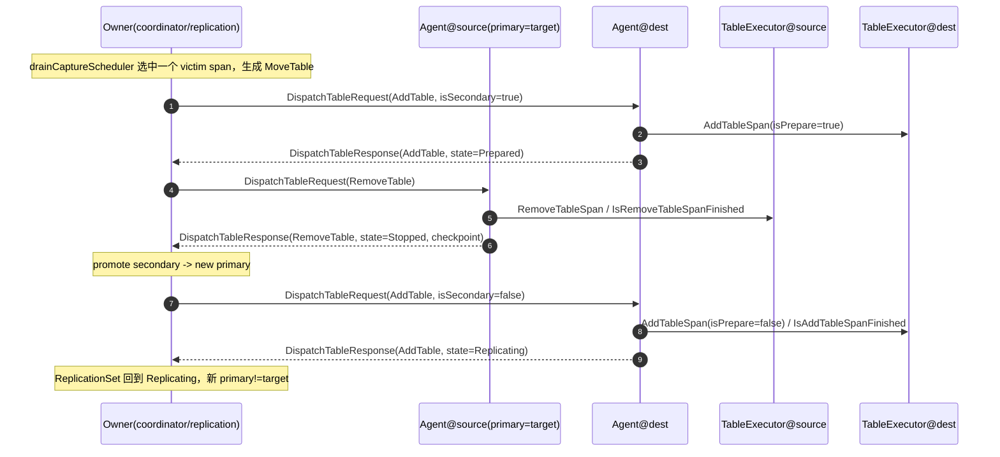

# TiCDC：`POST /api/v2/captures/{capture_id}/drain` 在 CDC Server 内部的执行链路

本文基于 `tiflow` 当前代码（TiCDC scheduler v3）梳理：当外部调用 `POST /api/v2/captures/{capture_id}/drain` 时，CDC Server 内部从 HTTP 入口到 Owner、再到 scheduler/processor 完成 table 迁移（drain）的完整执行路径与链路图。

---

## 1. API 语义与前置条件

- **HTTP**：`POST /api/v2/captures/:capture_id/drain`
- **处理节点**：仅 **Owner capture** 实际处理（非 owner 会被转发到 owner）。
- **前置条件**：
  - 存活 capture 数必须 **> 1**（否则无法把 table 迁移到其他 capture）。
  - `capture_id` 必须存在且 **不能是 owner 自己**。
- **返回值**：`202 Accepted`，body 为 `model.DrainCaptureResp{ current_table_count }`。
  - `current_table_count` 是 **Owner 在收到请求时刻**统计的“目标 capture 上当前仍作为 primary 在跑的表数量总和（跨所有 normal changefeed）”。
  - **注意**：API 返回并不代表 drain 已完成；真正的 table 迁移是后续多个 tick 内逐步完成的异步过程。

相关结构体：`cdc/model/http_model.go` 中 `DrainCaptureResp`。

---

## 2. 同步请求链路（HTTP 收到请求 → Owner 返回 202）

这一段是“HTTP 请求在 CDC Server 内部被谁处理、如何进入 owner job 队列并得到一次性统计结果”的同步路径。

### 2.1 HTTP Server 与路由注册

1. TiCDC HTTP server 启动：`cdc/server/server.go` 的 `(*server).startStatusHTTP`
2. 注册所有 HTTP 路由：`cdc/http.go` 的 `RegisterRoutes`
3. 注册 v2 OpenAPI 路由：`cdc/api/v2/api.go` 的 `RegisterOpenAPIV2Routes`
4. 路由绑定：`POST /api/v2/captures/:capture_id/drain` → `OpenAPIV2.drainCapture`

### 2.2 中间件链（非常关键：ForwardToOwner）

`RegisterOpenAPIV2Routes` 为 `/api/v2` group 安装了如下中间件（按调用顺序）：

1. `middleware.CheckServerReadyMiddleware`：未 ready 直接返回 `503`（实际返回码由 `ErrorHandleMiddleware` 统一处理逻辑影响）
2. `middleware.LogMiddleware`：记录访问日志
3. `middleware.ErrorHandleMiddleware`：将 `c.Error(err)` 统一转为 JSON 错误响应
4. `/captures` group 额外挂载 `middleware.ForwardToOwnerMiddleware`：
   - 当前 capture 不是 owner：调用 `api.ForwardToOwner` / `api.ForwardToCapture` 将请求 **HTTP 反向代理**到 owner，然后 `ctx.Abort()`
   - 当前 capture 是 owner：`ctx.Next()` 放行给 handler

也就是说：**无论客户端把请求打到哪个 TiCDC 节点，最终都会在 owner 上执行 `OpenAPIV2.drainCapture`。**

### 2.3 Handler 同步调用路径（函数级路径）

以下路径是“调用栈/链路”视角（省略了 gin 框架内部细节）：

1. `cdc/api/v2/capture.go`: `(*OpenAPIV2).drainCapture`
2. 查询 captures 列表（用于校验与前置条件判断）：
   - `h.capture.StatusProvider().GetCaptures(ctx)`
   - `cdc/owner/status_provider.go`: `(*ownerStatusProvider).GetCaptures` → `sendQueryToOwner`
   - `cdc/owner/owner.go`: `(*ownerImpl).Query`（入队 owner job）
   - `cdc/owner/owner.go`: `(*ownerImpl).handleJobs` → `handleQueries(QueryCaptures)`（在 owner tick 中出队执行）
3. handler 侧校验：
   - 存活 captures 数量 > 1
   - `capture_id` 存在
   - `capture_id != ownerID`
4. 触发 drain 请求（同样通过 owner job 队列串行化到 owner tick 执行）：
   - `cdc/api/util.go`: `api.HandleOwnerDrainCapture`
   - `capture.GetOwner()`（已由 ForwardToOwnerMiddleware 保证为 owner）
   - `owner.DrainCapture(query, done)` → `cdc/owner/owner.go`: `(*ownerImpl).DrainCapture`（pushOwnerJob）
   - HTTP handler 阻塞等待 `done`（或 ctx cancel）
5. owner tick 中真正处理 drain job：
   - `cdc/owner/owner.go`: `(*ownerImpl).Tick` → `handleJobs`
   - `handleJobs` 遇到 `ownerJobTypeDrainCapture` → `handleDrainCaptures`
6. `handleDrainCaptures` 填充 `query.Resp = &model.DrainCaptureResp{ CurrentTableCount: ... }` 并关闭 `done`
7. HTTP handler 收到 done，返回 `202 Accepted` + `DrainCaptureResp`

---

## 3. Owner 侧 drain 请求的处理逻辑（`handleDrainCaptures`）

`handleDrainCaptures` 的核心任务是：

1) 做一次必要的“环境校验”（上游 TiKV store version 检查）；
2) 对每个 **normal changefeed** 发起一次 `scheduler.DrainCapture(target)`，并汇总当前表数到 `CurrentTableCount`。

关键逻辑（概念化）：

- 先 `upstreamManager.Visit` → `upstream.CheckTiKVStoresVersion(ctx)`；失败则：
  - `query.Resp.CurrentTableCount = 0`
  - `done <- err` 并关闭 channel
- 遍历 `o.changefeeds`：
  - 非 `model.StateNormal`：跳过
  - `changefeed.scheduler == nil`：
    - 记录日志（drain 发生在 scheduler 未初始化阶段）
    - `totalTableCount++`（刻意让 API 调用方“不要误以为已经 drain 完成”，需要重试）
  - 否则调用：`count, err := changefeed.scheduler.DrainCapture(target)`
    - `totalTableCount += count`
- `query.Resp = &model.DrainCaptureResp{ CurrentTableCount: totalTableCount }`

这也是为什么 API 的 `current_table_count` 既可能表示“真实表数”，也可能因为 **scheduler 未初始化**或 **capture 未完成初始化**而被“垫高到至少 1”，以驱动客户端重试。

---

## 4. 进入 scheduler v3：`changefeed.scheduler.DrainCapture` 做了什么

`changefeed.scheduler` 对应的是 scheduler v3 的 `coordinator`（`cdc/scheduler/internal/v3/coordinator.go`）。

`(*coordinator).DrainCapture(target)` 逻辑要点：

1. **未完成初始化**（`!captureM.CheckAllCaptureInitialized()`）：
   - **不接受**本次 drain（避免在成员信息不完备时调度）
   - 返回 `(count=1, err=nil)`：用“返回非 0 表数”的方式提示调用方重试
2. 统计当前该 changefeed 下，目标 capture 上作为 primary 的表数：
   - 遍历 `replicationM.ReplicationSets()`，`rep.Primary == target` 计数
3. 若 `count == 0`：直接返回（说明该 changefeed 在目标 capture 上没有 primary 表需要搬走）
4. 安全检查：
   - `len(c.captureM.Captures) > 1`（至少 2 个 capture，才有迁移目的地）
   - `target != ownerCaptureID`（不能 drain owner；上层 API 已先行校验）
5. 设置 drain 目标（per changefeed）：
   - `schedulerM.DrainCapture(target)` → `drainCaptureScheduler.setTarget(target)`
   - 若返回 false：表示当前已有一个 draining target，本次请求被忽略（只能同时 drain 一个 capture）

注意：这一步只是“把 target 写进 drainCaptureScheduler 的内部状态”。真正迁移表（MoveTable task、消息下发、processor 执行）发生在后续的 `scheduler.Tick` 周期中。

---

## 5. 异步 drain 的真正执行：在 `scheduler.Tick/poll` 中逐步迁移表

drain 的核心发生在 owner side 的 changefeed tick 调用 `scheduler.Tick` 时：

`cdc/owner/changefeed.go`: `(*changefeed).Tick` → `c.scheduler.Tick(...)`（scheduler v3 的 `coordinator.Tick`）

### 5.1 `coordinator.poll` 的关键阶段（与 drain 相关）

`coordinator.poll` 每个 tick 会：

1. `recvMsgs`：从 transport 收到来自各 processor(agent) 的消息（heartbeat response / dispatch response 等）
2. `captureM.HandleAliveCaptureUpdate` / `captureM.HandleMessage`：维护 capture 视图与初始化状态
3. `replicationM.HandleMessage`：用 response/table status 推进 replication set 状态机
4. `schedulerM.Schedule(...)`：选择“本 tick 要做的调度任务”
5. `replicationM.HandleTasks(allTasks)`：把调度任务转为对 agent 的请求消息（dispatch table request）
6. `captureM.Tick(..., drainingTarget, ...)`：定期给每个 capture 发 heartbeat
   - 其中 `drainingTarget := schedulerM.DrainingTarget()`
   - heartbeat 中 `IsStopping = (toCapture == drainingTarget)`，用于让 target capture 感知自己正在被 drain
7. `sendMsgs`：通过 transport 发出消息

### 5.2 drainCaptureScheduler 如何产生 MoveTable 任务

`schedulerM.Schedule` 内部按优先级执行（`basic` → `drain-capture` → `move/rebalance/balance`）。当轮到 `drainCaptureScheduler`：

- 若 `d.target` 尚未设置：
  - 会扫描 captures：找到 `CaptureStateStopping` 的非 owner capture，自动开始 drain（覆盖“kill TiCDC / graceful shutdown”的场景）
- 若 `d.target` 已设置（来自本 API 调用）：
  - 计算除 target 外各 capture 的 workload（当前 primary 表数量）
  - 遍历所有 replication sets：
    - **要求所有表都处于 `ReplicationSetStateReplicating`**，否则本 tick **skip drain**（避免在表迁移尚未完成时叠加新的迁移）
    - 收集最多 `maxTaskConcurrency` 个 `victimSpans`：满足 `rep.Primary == d.target`
  - 若 `victimSpans` 为空：认为 drain 完成，清空 `d.target`
  - 否则对每个 victimSpan：
    - 选择 workload 最小的目的 capture
    - 生成 `replication.ScheduleTask{ MoveTable: {Span, DestCapture} }`

这意味着：drain 过程通常以“批”为单位推进（批大小 ≤ `MaxTaskConcurrency`），并且每批需要等这批迁移全部完成（所有表回到 Replicating 状态）后，才会开始下一批。

---

## 6. Processor(agent) 侧：IsStopping、DispatchTableRequest 与表迁移状态机

### 6.1 Heartbeat 的 IsStopping 如何影响 target capture

owner 每个 tick（到达 heartbeatTick 时）会给所有 captures 发 `MsgHeartbeat`，其中对 target capture 设置 `Heartbeat.IsStopping=true`。

在 target capture 上：

- `cdc/scheduler/internal/v3/agent/agent.go`: `handleMessageHeartbeat`
  - 当 `request.IsStopping == true`：
    - `handleLivenessUpdate(model.LivenessCaptureStopping)`
  - `HeartbeatResponse` 携带 `Liveness`
- owner 侧：
  - `cdc/scheduler/internal/v3/member/capture_manager.go`: `CaptureStatus.handleHeartbeatResponse`
  - 如果 `resp.Liveness == LivenessCaptureStopping`：把该 capture 标记为 `CaptureStateStopping`

这条链路既用于“被动 drain（捕捉 stopping capture）”，也用于“主动 drain（本 API 设置 drainingTarget 后通知目标 capture 进入 stopping）”。

### 6.2 MoveTable 的核心消息链：DispatchTableRequest/Response

owner 在处理 `MoveTable` task 时，会通过 replication set 状态机拆成两阶段/三阶段的 dispatch：

1) **在目的 capture 上准备 secondary**
- owner → dest: `MsgDispatchTableRequest(AddTableRequest{ IsSecondary=true })`
- dest(agent)：
  - 记录 task（prepare）
  - 通过 `TableExecutor.AddTableSpan(..., isPrepare=true)` 启动 table 的 prepare
  - 达到 `Prepared` 稳态后回 `MsgDispatchTableResponse(AddTableResponse{ status=Prepared })`

2) **让原 primary（即 target）停止**
- owner → src(primary/target): `MsgDispatchTableRequest(RemoveTableRequest)`
- src(agent)：
  - `TableExecutor.RemoveTableSpan(...)` / `IsRemoveTableSpanFinished(...)`
  - 停止后回 `MsgDispatchTableResponse(RemoveTableResponse{ status=Stopped, checkpoint })`

3) **把 secondary 提升为新的 primary**
- owner 在 replication set 中 promote secondary
- owner → dest: `MsgDispatchTableRequest(AddTableRequest{ IsSecondary=false })`
- dest(agent)：
  - `AddTableSpan(..., isPrepare=false)` / `IsAddTableSpanFinished(...)`
  - 进入 `Replicating` 后回 `AddTableResponse`

当一个 span 的 primary 从 target 转移到其他 capture 后，该 span 就不再计入 drainCaptureScheduler 的 `victimSpans`；当所有 span 的 primary 都不在 target 上时，drainCaptureScheduler 清空 target，整个 drain 流程结束。

---

## 7. 链路图

### 7.1 总览（从 HTTP 到 scheduler/agent 的模块链路）

```mermaid
flowchart TD
  Client["Client"] -->|POST /api/v2/captures/{capture_id}/drain| Gin["Gin Router (TiCDC HTTP)"]

  Gin --> Ready["CheckServerReadyMiddleware"]
  Ready --> Log["LogMiddleware"]
  Log --> Err["ErrorHandleMiddleware"]
  Err --> Fwd{"ForwardToOwnerMiddleware\\nIsOwner?"}

  Fwd -- "no" --> Proxy["api.ForwardToOwner -> ForwardToCapture\\n(HTTP proxy to owner)"]
  Proxy --> OwnerGin["Owner capture Gin Router"]
  OwnerGin --> Handler["OpenAPIV2.drainCapture"]

  Fwd -- "yes" --> Handler

  Handler --> Captures["StatusProvider.GetCaptures\\n(owner.Query(QueryCaptures))"]
  Handler --> DrainReq["api.HandleOwnerDrainCapture\\n(owner.DrainCapture(query))"]
  Captures --> OwnerJobs["owner job queue"]
  DrainReq --> OwnerJobs

  OwnerJobs -->|ownerImpl.Tick: handleJobs| DrainJob["ownerImpl.handleDrainCaptures\\n(per changefeed)"]
  DrainJob --> CoordDrain["coordinator.DrainCapture\\n(set draining target)"]
  Handler -->|202 + current_table_count| Client

  CoordDrain --> Tick["coordinator.Tick/poll loops"]
  Tick --> Sched["drainCaptureScheduler.Schedule\\n(gen MoveTable tasks)"]
  Sched --> RepTasks["replicationM.HandleTasks\\n(ReplicationSet state machine)"]
  RepTasks -->|DispatchTableRequest| P2P["transport.Send (p2p)"]
  Tick -->|Heartbeat IsStopping| P2P
  P2P --> AgentT["agent@target capture"]
  P2P --> AgentD["agent@dest capture"]
  AgentT -->|LivenessCaptureStopping| CapState["captureM: CaptureStateStopping"]
  AgentD --> Exec["TableExecutor (processor)\\nAdd/Remove table span"]
  Exec -->|DispatchTableResponse\\nHeartbeatResponse| P2P
  P2P --> Tick
```

### 7.2 单表（span）MoveTable 的序列图（核心迁移链路）



---

## 8. 关键代码指针（建议从这里开始读）

**HTTP 入口与路由**
- `cdc/server/server.go`: `(*server).startStatusHTTP`
- `cdc/http.go`: `RegisterRoutes`
- `cdc/api/v2/api.go`: `RegisterOpenAPIV2Routes`
- `cdc/api/middleware/middleware.go`: `ForwardToOwnerMiddleware` / `CheckServerReadyMiddleware` / `ErrorHandleMiddleware`

**v2 handler 与 owner API 桥接**
- `cdc/api/v2/capture.go`: `(*OpenAPIV2).drainCapture`
- `cdc/api/util.go`: `HandleOwnerDrainCapture` / `ForwardToOwner` / `ForwardToCapture`

**Owner job 队列与 drain 入口**
- `cdc/owner/owner.go`: `(*ownerImpl).Tick` / `handleJobs` / `DrainCapture` / `handleDrainCaptures` / `pushOwnerJob`
- `cdc/owner/status_provider.go`: `(*ownerStatusProvider).GetCaptures` / `sendQueryToOwner`

**scheduler v3 drain 与 tick 主循环**
- `cdc/scheduler/internal/v3/coordinator.go`: `(*coordinator).DrainCapture` / `Tick` / `poll`
- `cdc/scheduler/internal/v3/scheduler/scheduler_manager.go`: `(*Manager).DrainCapture` / `DrainingTarget` / `Schedule`
- `cdc/scheduler/internal/v3/scheduler/scheduler_drain_capture.go`: `(*drainCaptureScheduler).Schedule`
- `cdc/scheduler/internal/v3/member/capture_manager.go`: `(*CaptureManager).Tick`（Heartbeat.IsStopping）

**表迁移消息与状态机**
- `cdc/scheduler/internal/v3/replication/replication_manager.go`: `(*Manager).HandleTasks`
- `cdc/scheduler/internal/v3/replication/replication_set.go`: `handleMoveTable` / `poll` / `pollOnPrepare` / `pollOnCommit`
- `cdc/scheduler/internal/v3/agent/agent.go`: `handleMessageHeartbeat` / `handleMessageDispatchTableRequest`
- `cdc/scheduler/internal/v3/agent/table.go`: `tableSpanManager.poll` / `tableSpan.handleAddTableTask` / `handleRemoveTableTask`

