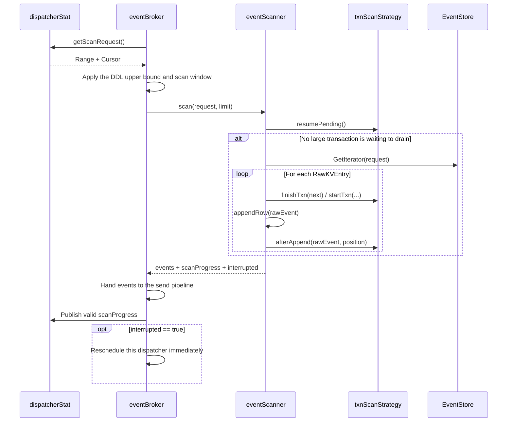
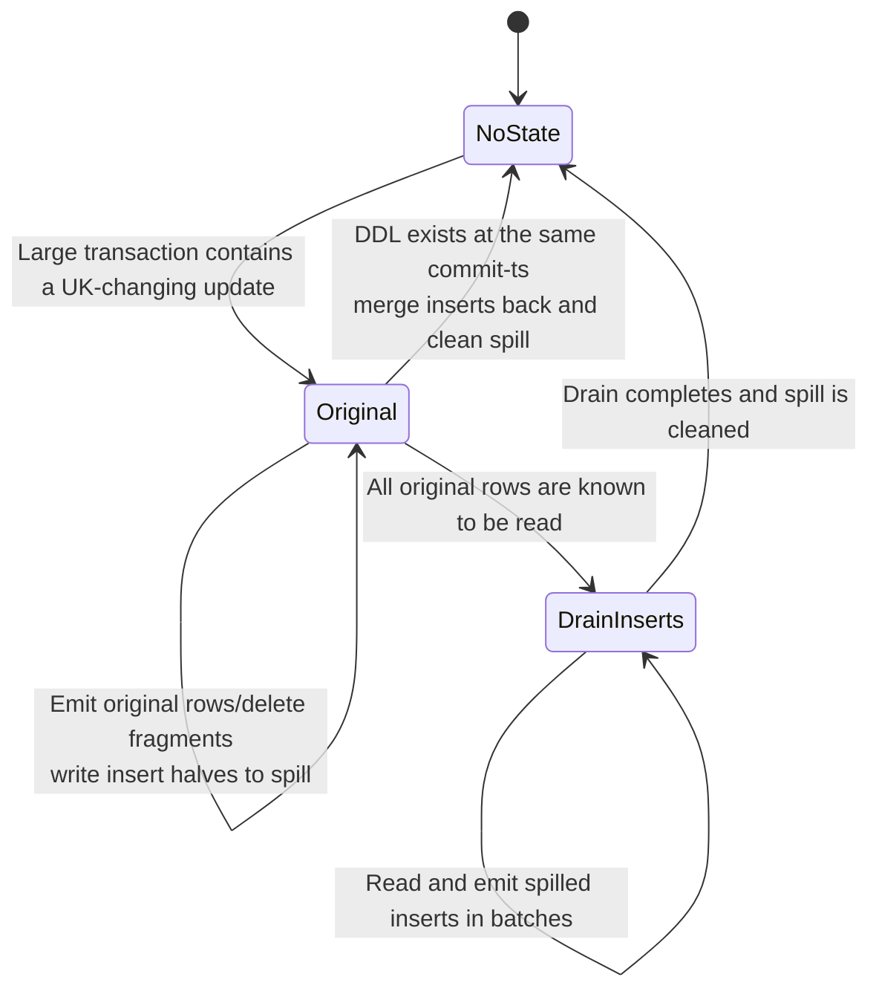

# EventService Scan Progress and Transaction Scan Strategies

This document explains the roles of the following two files in the TiCDC
new-architecture EventService and how they work together:

- [`pkg/eventservice/scan_progress.go`](../../pkg/eventservice/scan_progress.go)
- [`pkg/eventservice/txn_scan_strategy.go`](../../pkg/eventservice/txn_scan_strategy.go)

Related code includes:

- [`pkg/eventservice/event_scanner.go`](../../pkg/eventservice/event_scanner.go):
  the common scan loop, DDL/DML merge, and DML decoding.
- [`pkg/eventservice/dispatcher_stat.go`](../../pkg/eventservice/dispatcher_stat.go):
  stores the next scan position of a dispatcher.
- [`pkg/eventservice/event_broker.go`](../../pkg/eventservice/event_broker.go):
  creates scan requests, sends scan results, and publishes new progress.
- [`logservice/eventstore/scan_request.go`](../../logservice/eventstore/scan_request.go):
  defines EventStore scan ranges and resume cursors.
- [`pkg/eventservice/large_txn_state.go`](../../pkg/eventservice/large_txn_state.go):
  stores large-transaction state across scan attempts.

## 1. Two conclusions to remember

`scanProgress` answers this question:

> After this scan attempt finishes, where should the next EventStore read
> resume?

It is neither a downstream checkpoint nor merely a resolved-ts. A scan may stop
at the end of a timestamp range, between two transactions with the same
commit-ts, or even between two rows of the same transaction. These cases need
resume positions with different levels of precision.

`txnScanStrategy` answers a different question:

> While scanning a transaction, may the scanner stop inside it, and how should
> the scanner finish that transaction after such an interruption?

It contains only the differences between atomic and split modes. Common logic,
including EventStore iteration, SchemaStore access, DDL/DML ordering, and DML
decoding, remains in `eventScanner`.

## 2. Where they sit in the scan pipeline



Three objects in this pipeline are easy to confuse:

| Object | Meaning |
| --- | --- |
| `ScanRequest.Range` | The commit-ts range that this attempt may scan. |
| `ScanRequest.Cursor` | The starting point inside `Range.CommitTsStart`. |
| `scanProgress` | The resume position produced by this attempt for the next attempt. |

In short, `ScanRequest` is the input and `scanProgress` is the output. Before
the next scan, the dispatcher converts the previous `scanProgress` into a new
`ScanRequest`.

## 3. What `scanProgress` represents

The structure has four fields:

```go
type scanProgress struct {
    valid                bool
    txnCommitTs          uint64
    txnStartTs           uint64
    rowLevelScanPosition eventstore.ScanPosition
}
```

### 3.1 Field semantics

| Field | Meaning |
| --- | --- |
| `valid` | Whether this scan produced a complete new resume position that is safe to publish. |
| `txnCommitTs` | The commit-ts containing the resume point and the next `Range.CommitTsStart`. |
| `txnStartTs` | The transaction already processed within the same commit-ts. |
| `rowLevelScanPosition` | The EventStore record after which the scan should resume inside that transaction. |

The name `txnCommitTs` can be slightly misleading. When `txnStartTs == 0` and
there is no row position, it may denote a fully scanned timestamp boundary
rather than an unfinished transaction.

### 3.2 Three valid progress forms

Let `C` be a commit-ts, `S` a start-ts, and `P` a row position returned by
EventStore.

| Progress | Meaning | How the next attempt scans |
| --- | --- | --- |
| `(C, 0, nil)` | Everything through `C` has been fully processed. | Perform a normal scan over `(C, End]`. |
| `(C, S, nil)` | Original EventStore records at commit-ts `C` with start-ts no greater than `S` have been processed; spilled inserts may still need draining. | Continue with transactions at commit-ts `C` whose start-ts is greater than `S`, then scan later commit-ts values. |
| `(C, S, P)` | Transaction `(S, C)` is in progress and records through position `P` have been processed. | Resume after `P` in EventStore. |

When `Position` is non-empty, EventStore uses it as the exact lower bound. It
takes precedence over `TxnStartTs`.

That precedence is necessary because `(C, S)` alone cannot resume inside the
same transaction. For example, transaction `(S=10, C=100)` has three records,
`r1`, `r2`, and `r3`:

```text
Store only (100, 10, nil)     -> EventStore treats the transaction as done and skips r2 and r3
Store (100, 10, position1)    -> EventStore resumes after r1 and returns r2 and r3
```

### 3.3 How `scanProgress` becomes the next request

`dispatcherStat.getScanRequest()` performs this mapping:

```text
scanProgress.txnCommitTs          -> Range.CommitTsStart
dispatcher.receivedResolvedTs     -> Range.CommitTsEnd
scanProgress.txnStartTs           -> Cursor.TxnStartTs
scanProgress.rowLevelScanPosition -> Cursor.Position
```

`eventBroker.getScanTaskRequest()` then restricts `CommitTsEnd` using the
SchemaStore resolved-ts and the adaptive scan window.

A row cursor has an additional invariant. A published row cursor at `C` proves
that the previous request had a legal upper bound covering `C`. The DDL
resolved-ts and received resolved-ts do not move backward, so only a later
shrink of the adaptive scan window can move `CommitTsEnd` behind `C`. In that
case, the broker restores the range to `[C, C]`. EventStore can then use
`Position` to return the remaining rows from the transaction at `C`.

### 3.4 Why `valid` is needed

The zero value of `session.progress` is not a valid resume point. A scan may
return after context cancellation, dispatcher removal, or another interruption
that did not produce a complete cursor. `eventBroker.doScan()` replaces the
dispatcher progress only when `valid == true`.

Every value created by `newTxnScanProgress` or `newRowLevelScanProgress` has
`valid=true`. Typical sources are:

- A complete scan through `CommitTsEnd` publishes `(End, 0, nil)`.
- An interruption after a row in a large transaction publishes
  `(C, S, Position)`.
- Completion of the original rows before insert draining publishes
  `(C, S, nil)`.
- Partial draining of spilled inserts continues to publish `(C, S, nil)`; the
  large-transaction state stores the drain-specific position.

An ordinary interruption at a transaction boundary may have no explicit
`scanProgress`. DML already emitted through the broker send path updates the
dispatcher to `(lastCommitTs, lastStartTs, nil)`.

Row-level fragments are different. While sending a DML fragment, the send path
can see only transaction-level progress `(C, S)`. Therefore, after processing
the result events, `doScan()` must overwrite that value with the scanner's
`(C, S, Position)`. Otherwise the next attempt would treat an unfinished
transaction as complete.

### 3.5 Why progress is an immutable snapshot

The dispatcher publishes one complete progress value through an
`atomic.Pointer[scanProgress]` instead of publishing three fields separately.

Separate updates could let the next scan observe a mixed state, such as a new
`txnCommitTs` combined with an old `txnStartTs` and old `Position`. Such a
combination describes no real scan result and may duplicate or skip data.

The underlying type of `ScanPosition` is `[]byte`, so code also clones the
slice when storing and reading a snapshot. This prevents callers from mutating
an already published cursor.

## 4. Why `txnScanStrategy` exists

The main `eventScanner` loop is nearly identical in both transaction modes:

1. Read the next RawKV from EventStore.
2. Detect transaction boundaries from commit-ts and start-ts.
3. Fetch the appropriate version of TableInfo.
4. Decode and merge DML and DDL events.
5. Check scan limits, context cancellation, and dispatcher lifecycle state.

Only four transaction-lifecycle points differ, so the interface has four
methods:

| Method | When it is called | Atomic mode | Split mode |
| --- | --- | --- | --- |
| `resumePending` | At the beginning of every scan, before creating an EventStore iterator. | No operation. | If the previous attempt entered the drain phase, emit more inserts from the spill file first. |
| `startTxn` | When a new transaction begins. | Create a `TxnEvent` that cannot be split across scans. | Create a `TxnEvent` that may be split across scans. |
| `finishTxn` | At the next transaction or iterator EOF. | Commit the complete current transaction. | Commit the current fragment and handle the original-to-drain phase transition. |
| `afterAppend` | After appending each RawKV. | No operation; the scanner cannot stop inside the transaction. | After the large-transaction threshold is exceeded and a row position exists, the scanner may stop after the current row. |

The configuration selects the strategy:

```go
newTxnScanStrategy(dispatcherStat.txnAtomicity.ShouldSplitTxn())
```

- `transaction-atomicity=table` selects the atomic strategy.
- `transaction-atomicity=none` selects the split strategy.

Here, atomic means only that the upstream transaction observed by one table
dispatcher is not divided across multiple scan results. The scanner may still
stop between transactions, and this option does not provide whole-transaction
atomicity across multiple tables.

## 5. Atomic strategy flow

The atomic strategy is intentionally thin because it enforces only one rule:
the scanner cannot stop inside a transaction.

```text
startTxn
  -> Append all RawKV records with the same (startTs, commitTs) to the current TxnEvent
  -> afterAppend never requests an interruption
  -> Reach the next transaction or EOF
  -> finishTxn commits the whole transaction
```

Even after the scan byte limit is reached, the common loop waits for a
transaction boundary before stopping. Therefore, one very large transaction
may make a scan exceed its normal limit. This is the cost of preserving table
transaction atomicity.

## 6. Split strategy flow

The split strategy may emit a large transaction over several scan attempts. It
must still resume precisely and correctly handle updates that change a unique
key.

### 6.1 Row-level resume for an ordinary large transaction

Assume transaction `(S=10, C=100)` has three EventStore records and the
threshold allows one record per attempt:

```text
Attempt 1: read r1 -> emit fragment 1 -> progress=(100, 10, P1)
Attempt 2: resume after P1, read r2 -> emit fragment 2 -> progress=(100, 10, P2)
Attempt 3: resume after P2, read r3 -> finish transaction -> progress=(100, 0, nil)
```

An interruption inside a transaction requires all of the following:

1. The EventStore iterator provides a non-empty `Position`.
2. Raw KV bytes in the current fragment exceed the large-transaction threshold.
3. No insert half of a unique-key-changing update remains only in memory.
4. The DML/DDL merger allows an interruption at this commit-ts.

`DMLEventMaxRows` and `DMLEventMaxBytes` are different from the
large-transaction threshold. The former values create multiple `DMLEvent`
objects inside one `BatchDMLEvent`. Only the latter allows the transaction to
be interrupted across scan attempts and publishes a row cursor.

### 6.2 Why a unique-key-changing update must spill

An update that changes a unique key becomes one delete and one insert. If a
large transaction is divided into fragments, emitting the insert too early may
cause a downstream unique-key conflict before other deletes in the same
transaction have executed.

The split strategy therefore uses two phases:



During `largeTxnScanPhaseOriginal`:

- The scanner reads original EventStore data.
- The delete half of a unique-key-changing update enters the normal DML fragment.
- The corresponding insert half is written to a spill file.
- A row cursor records how far the original EventStore scan has advanced.

During `largeTxnScanPhaseDrainInserts`:

- The scanner no longer creates an EventStore iterator.
- `resumePending` reads directly from the spill file at the beginning of a scan.
- Inserts may be emitted in batches according to the scan limit.
- Completion closes the reader, removes the spill file, and clears the
  dispatcher's large-transaction state.

This guarantees that all delete halves of the same large transaction precede
the delayed insert halves. Draining also completes before any following
transaction, including another transaction with the same commit-ts.

### 6.3 Why `finishTxn` may run when `currentTxn == nil`

At the beginning of a scan after row-level resume,
`dmlProcessor.currentTxn` is still nil, but the dispatcher may retain a
`largeTxnScanPhaseOriginal` state.

The strategy must first inspect the next record returned by the iterator:

- If it still belongs to the same `(S, C)`, original rows remain and scanning
  continues.
- If it belongs to another transaction, or the iterator is at EOF, the
  original transaction is complete and the strategy enters the drain phase.

Consequently, `finishTxn` means more than "commit `currentTxn`". It also
confirms whether a large transaction retained across scan attempts has reached
the end of its original data. That is why the common loop calls it even when
`currentTxn == nil`.

### 6.4 Why the drain phase does not use a row position

After entering the drain phase, the data source is the spill file rather than
EventStore:

- `scanProgress` stays at `(C, S, nil)`, preventing EventStore from moving
  beyond the large transaction.
- `largeTxnScanState.drainedInsertCount` records how many inserts are included
  in completed drain scan results.
- If a drain attempt fails, the reader rolls back to the committed
  `drainedInsertCount` and retries from there next time.

The system therefore has two cursors at different storage layers:

| Cursor | Layer | Purpose |
| --- | --- | --- |
| `scanProgress` | EventStore scan layer | Prevent the original-data scan from passing transaction `(S, C)`. |
| `drainedInsertCount` | Spill drain layer | Resume insert output inside the spill file. |

Putting the spill offset into `scanProgress` would mix the cursor semantics of
two storage layers, so the two values remain separate.

### 6.5 Special handling for a DDL at the same commit-ts

TiCDC must order DML before DDL at the same commit-ts and must not divide an
unsafe same-commit-ts DML/DDL group.

If a large transaction with spilled inserts also has a DDL at `C`, the split
strategy does not enter a separate drain phase. Instead, it merges cached and
spilled inserts back into the current transaction batch, emits events in
`DML(C) -> DDL(C)` order, and then cleans the large-transaction state.

## 7. The difference between `handled`, `interrupted`, and `valid`

These booleans belong to different layers:

| Value | Producer | Meaning |
| --- | --- | --- |
| `handled` | `resumePending` | Pending-state logic completely handled this attempt; do not access EventStore. |
| `interrupted` | Strategy/scanner | This attempt stopped intentionally with unfinished work; the broker should reschedule it immediately. |
| `scanProgress.valid` | Scanner/session | The returned resume position is complete and safe to publish to the dispatcher. |

Typical combinations are:

- Normal complete scan: `handled=false, interrupted=false, valid=true`.
- Row-level large-transaction fragment: `handled=false, interrupted=true, valid=true`.
- Partial spill drain: `handled=true, interrupted=true, valid=true`.
- Context cancellation or dispatcher removal: usually no new publishable progress.

## 8. Invariants that must be preserved

Changes to these two files or adjacent code must preserve at least these
invariants:

1. A non-empty `Position` takes precedence over `TxnStartTs`.
2. A row cursor `(C, S, P)` requires the next scan range to cover at least `C`.
3. After sending a row fragment, the final published value must remain a row
   cursor rather than being overwritten by transaction-level `(C, S)`.
4. The commit-ts, start-ts, and position in one `scanProgress` must originate
   from the same scan result.
5. A `Position` must be cloned before being retained across goroutines or scan
   attempts.
6. The atomic strategy may stop only at a transaction boundary.
7. The split strategy may stop inside a transaction only when EventStore
   provides an exact row position.
8. Delayed inserts from unique-key-changing updates must drain after the
   original transaction ends and before a following transaction begins.
9. EventStore progress must not pass the corresponding large transaction while
   its spill drain is incomplete.
10. A failed or canceled scan must not publish an incomplete new cursor.

## 9. Suggested source-reading order

For further source inspection, use this order:

1. `scan_progress.go`: understand the three resume forms first.
2. `logservice/eventstore/scan_request.go` and EventStore `GetIterator`:
   understand how a cursor becomes an iterator lower bound.
3. `dispatcherStat.getScanRequest()`: see how the previous progress becomes the
   next request.
4. `eventBroker.getScanTaskRequest()`: see how the DDL upper bound and scan
   window modify the range.
5. `eventScanner.scan()` and `scanAndMergeEvents()`: find the four strategy
   hook locations.
6. `txn_scan_strategy.go`: follow the atomic and split implementations
   separately.
7. `large_txn_state.go`: understand the original/drain phases and spill cursor.
8. `eventBroker.doScan()`: see why scanner progress is published after result
   events are processed.

In one sentence:

> `scanProgress` guarantees that the next scan reads from the correct place;
> `txnScanStrategy` guarantees that the current scan stops only at a safe place.
