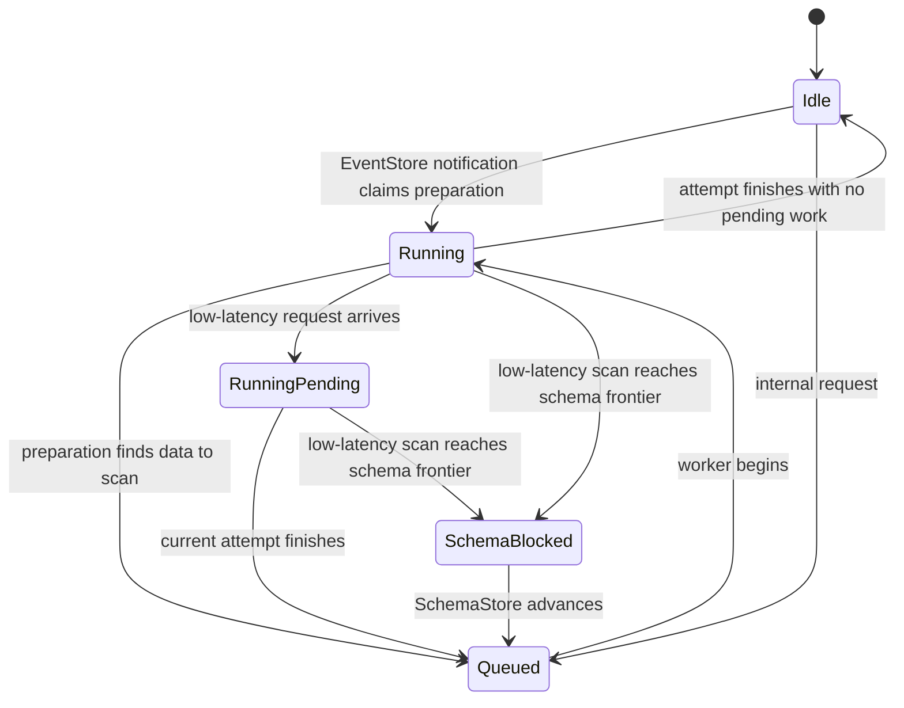

# Changefeed Low-Latency EventService

## Motivation

TiCDC changefeeds have different performance goals. A throughput-oriented
changefeed can batch resolved-ts updates and scan scheduling work. A
latency-oriented changefeed should react to new progress as soon as possible,
without changing the behavior of throughput changefeeds running on the same
CDC cluster.

This design applies the low-latency choice per changefeed. EventStore keeps the
two modes isolated, and EventService uses a small state machine to schedule
low-latency scans without creating duplicate work.

## Design

### EventStore subscriptions

The dispatcher registration carries whether its changefeed uses low-latency
mode. EventStore uses this value in two ways:

- A subscription can be shared only with dispatchers using the same mode.
  Low-latency and throughput changefeeds therefore cannot accidentally inherit
  each other's resolved-ts advancement behavior.
- A new low-latency subscription sets the LogPuller resolved-ts advance
  interval to zero. It publishes each available resolved-ts update immediately.
  Throughput subscriptions keep the configured batching interval.

### EventService scan scheduling

When EventStore reports a new resolved-ts, EventService first checks whether a
real EventStore read is necessary. If no row event needs to be read, it can
send progress without occupying the scan worker queue. This fast path also
preserves the ordering of sync-point and resolved events.

If a low-latency dispatcher receives another scan request while one attempt is
running, EventService records one pending continuation. Multiple notifications
are coalesced into that single continuation, so the dispatcher promptly checks
the newest frontier without adding one task per notification. Throughput mode
keeps its existing behavior and does not create this continuation.

Internal continuation and retry paths use non-blocking queue insertion. When
the queue is full, the dispatcher returns to a recoverable state and a later
signal can schedule it again. The EventStore notification path may wait for
queue capacity after it has confirmed that a real scan is required. The
`ticdc_event_service_dropped_scan_task_count` counter records failed internal
scheduling attempts; it does not mean that a data event was dropped.

### Dispatcher scan state machine

Each dispatcher has one `dispatcherScanState`, protected by `scanMu`:

| State | Meaning |
| --- | --- |
| `dispatcherScanIdle` | No preparation or scan task is outstanding. |
| `dispatcherScanQueued` | A task is waiting in a scan worker queue. |
| `dispatcherScanRunning` | One goroutine owns scan preparation or execution. |
| `dispatcherScanRunningPending` | A low-latency request arrived while the dispatcher was running. |
| `dispatcherScanSchemaBlocked` | Progress is waiting for SchemaStore to advance. |
| `dispatcherScanRemoved` | The dispatcher is removed; this state is terminal for that dispatcher instance. |

The main transitions are:

The `Running` state deliberately covers both inline preparation and worker
execution. This gives both paths the same ownership rule and prevents them
from checking or updating one dispatcher concurrently.

An interrupted scan is queued again. If an internal enqueue fails because the
worker queue is full, its fallback is `Idle`, so the next notification can
recover it. A failed schema retry stays `SchemaBlocked`, so the retry loop can
try again. Removing or resetting a dispatcher marks the old dispatcher state
as `Removed`; a reset creates a new dispatcher state starting from `Idle`.

### Schema-blocked retry and active scans

A low-latency scan may be ready in EventStore but unable to advance beyond the
current SchemaStore resolved-ts. EventService records the blocking frontier in
`dispatcherScanSchemaBlocked`. A keyspace-level retry loop watches SchemaStore
progress and queues the dispatcher when that frontier advances. This avoids
waiting for another EventStore notification that may never arrive.

EventService registers an active scan only after it has confirmed a non-empty
scan range and acquired the required quota. Fast-path progress updates and
other no-scan attempts do not create an active-scan lifecycle. Dispatcher
removal cancels a real active scan before cleanup.

For operational diagnostics, queued, running, and running-pending dispatchers
are all reported as busy. This makes slow-dispatcher logs reflect the scheduler
state even before a worker starts the actual EventStore scan.

## Compatibility

Low-latency behavior is enabled only for dispatchers whose changefeed selects
that mode. Throughput changefeeds retain their configured LogPuller batching
interval and do not use running-request continuation or schema-blocked parking.
Both modes continue to use the same bounded worker queues, scan limits, memory
quotas, and event ordering rules.

## Existing test coverage

The focused unit tests cover the main behavior:

- `TestEventStoreSeparatesSubscriptionsByPerformanceMode` verifies subscription
  isolation, reuse within one mode, and the zero/default advance intervals.
- `TestNotifyFastPathSerializesRunningNotification` and
  `TestNotifyFastPathPreservesSyncPointOrder` verify inline preparation,
  serialization, continuation, and event ordering.
- `TestLowLatencyScanRequestWhileRunningSchedulesContinuation` and
  `TestThroughputModeDoesNotContinueScanRequestWhileRunning` compare the two
  scheduling modes.
- `TestLowLatencyScanContinuationQueueFullRecoversOnNextNotify`,
  `TestInterruptedScanQueueFullRecoversOnNextNotify`, and
  `TestNotifyQueueFullWaitsForCapacity` cover bounded-queue behavior and
  recovery.
- `TestRunningNotifyParksAtSchemaBlock`,
  `TestLowLatencySchemaBlockedQueueFullRetriesWithoutNotify`,
  `TestThroughputModeDoesNotParkSchemaBlockedDispatcher`, and
  `TestResetSchemaBlockedDispatcherRemovesOldEpoch` cover SchemaStore blocking,
  retry, mode isolation, and dispatcher reset.
- `TestNoScanTaskDoesNotCreateActiveScanLifecycle` and
  `TestDispatcherLifecycleCancelsActiveScanBeforeCleanup` cover active-scan
  creation and cancellation.
