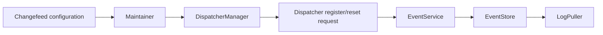
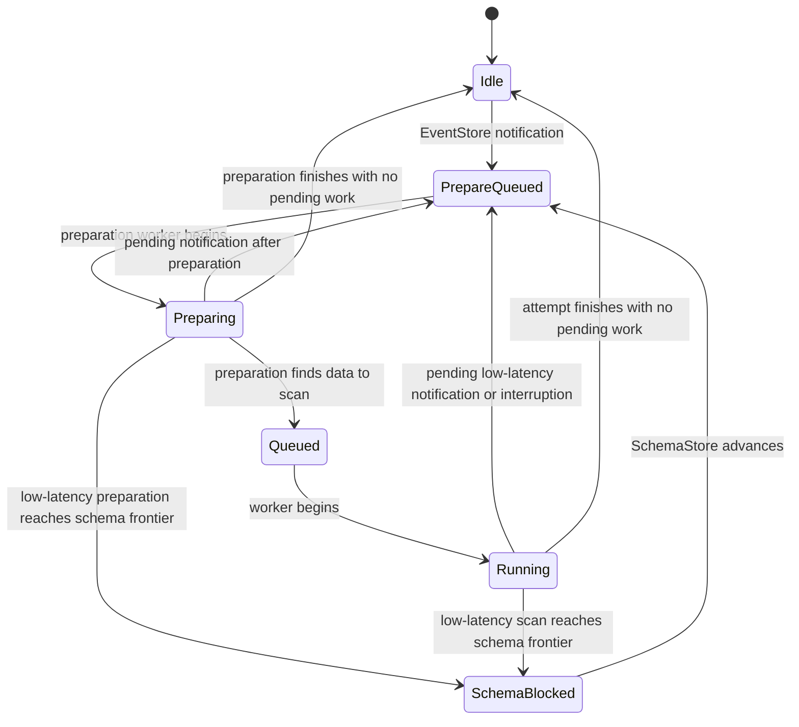

# Changefeed-Level Low-Latency Mode

## Motivation

TiCDC changefeeds have different performance goals. A throughput-oriented
changefeed can batch progress updates and scheduling work. A latency-oriented
changefeed should react to new progress as soon as possible, without changing
the behavior of throughput changefeeds running on the same CDC cluster.

This design applies the choice per changefeed and is implemented in two parts:

- [PR #5862](https://github.com/pingcap/ticdc/pull/5862) adds the persisted
  configuration, mode propagation, and low-latency control-plane reporting.
- [PR #5900](https://github.com/pingcap/ticdc/pull/5900) adds mode-isolated
  EventStore subscriptions and low-latency EventService scan scheduling.

The mode follows this path:

## Configuration and control plane (PR #5862)

### Configuration and propagation

`ReplicaConfig` adds `performance-mode` with two accepted values:

- `throughput`, which is the default and preserves existing behavior.
- `low-latency`, which enables the faster paths described below.

The field is persisted with the changefeed and is supported by the API and
TOML conversion paths. Configuration validation rejects unknown values.

When a changefeed starts, the mode is copied into its runtime
`ChangefeedConfig` and shared by its dispatchers. EventCollector then includes
`low_latency_mode` in both dispatcher register and reset requests. This gives
EventStore and EventService a per-dispatcher mode without relying on a global
server setting.

### Dispatcher and Maintainer reporting

A throughput DispatcherManager sends dispatcher heartbeats every 200 ms and
uses a one-second initial delay. A low-latency DispatcherManager sends them
every 50 ms and starts without the initial delay.

Maintainer also reacts to low-latency progress instead of relying only on its
periodic work:

- An accepted dispatcher watermark update signals a coalesced channel that
  wakes checkpoint and resolved-ts calculation.
- When the committed Maintainer watermark changes, another coalesced signal
  asks MaintainerManager to report the status promptly to Coordinator.

The channels have capacity one, so repeated updates request prompt work without
building an unbounded notification backlog. Throughput mode keeps the periodic
calculation and reporting behavior.

Maintainer clears the observed `statusChanged` flag before taking a heartbeat
or bootstrap snapshot. If another update races with the snapshot, it sets the
flag again and remains visible to the next report instead of being cleared
after the new state was produced.

### LogCoordinator resolved-ts metrics

EventService reports each changefeed's minimum received resolved-ts from every
node. LogCoordinator now publishes `ticdc_owner_resolved_ts` and
`ticdc_owner_resolved_ts_lag` only after every current reporting node has
contributed to a complete round.

The published resolved-ts is the minimum node value. The lag is the maximum
per-node lag, with each node's lag calculated at that node's own report time.
This avoids combining a timestamp from one node with a later clock sample from
another node.

These owner metrics describe the EventService received frontier. They are not
the EventService sent resolved-ts or the Maintainer checkpoint-ts, so they do
not directly measure downstream processing latency.

## Event delivery path (PR #5900)

### EventStore subscriptions

The dispatcher registration carries whether its changefeed uses low-latency
mode. EventStore uses this value in two ways:

- A subscription can be shared only with dispatchers using the same mode.
  Low-latency and throughput changefeeds therefore cannot accidentally inherit
  each other's resolved-ts advancement behavior.
- A new low-latency subscription sets the LogPuller resolved-ts advance
  interval to zero. It publishes each available resolved-ts update immediately.
  Throughput subscriptions keep the configured batching interval.

### EventService scan scheduling

When EventStore reports a new resolved-ts, its callback only updates the latest
dispatcher frontier and queues one preparation task. A separate preparation
worker checks whether a real EventStore read is necessary. If no row event
needs to be read, it can send progress without occupying the scan worker queue.
This fast path also preserves the ordering of sync-point and resolved events
without exposing EventStore to scan-queue backpressure.

Notifications received while preparation is queued are folded into that task,
which reads the latest dispatcher frontier. A notification received while
preparation is running records one pending continuation in both modes, because
preparation is now asynchronous. If a low-latency dispatcher receives another
request while a scan is running, it also records one pending continuation.
Multiple notifications are coalesced without adding one task per notification.
Throughput mode keeps its existing behavior while a scan is running.

The preparation queue is an unbounded wakeable FIFO, but dispatcher state
limits it to at most one entry per dispatcher. The existing bounded worker
channel remains the only scan queue. A preparation worker may wait for scan
queue capacity after confirming that a real scan is required; EventStore never
waits on that channel. Internal continuations and schema retries return to the
preparation queue, so queue saturation does not drop the last scheduling
signal or require another EventStore notification for recovery.

### Dispatcher scan state machine

Each dispatcher has one `dispatcherScanState`, protected by `scanMu`:

| State | Meaning |
| --- | --- |
| `dispatcherScanIdle` | No preparation or scan task is outstanding. |
| `dispatcherScanPrepareQueued` | A task is waiting in a preparation queue. |
| `dispatcherScanPreparing` | A preparation worker owns the dispatcher. |
| `dispatcherScanQueued` | A task is waiting in a scan worker queue. |
| `dispatcherScanRunning` | A scan worker owns the dispatcher. |
| `dispatcherScanSchemaBlocked` | Progress is waiting for SchemaStore to advance. |
| `dispatcherScanRemoved` | The dispatcher is removed; this state is terminal for that dispatcher instance. |

`scanPending`, protected by the same mutex, records one coalesced follow-up
received while preparation or a low-latency scan is running.

The main transitions are:

Preparation and scan execution have distinct ownership states. This keeps the
EventStore callback outside both operations while preventing them from checking
or updating one dispatcher concurrently.

An interrupted scan is prepared again. All scheduling requests, including a
dispatcher reset, enter the preparation queue, so only a preparation worker can
submit work to the bounded scan queue. Removing or resetting a dispatcher marks
the old dispatcher state as `Removed`; a reset creates a new dispatcher state
starting from `Idle`.

### Schema-blocked retry and active scans

A low-latency scan may be ready in EventStore but unable to advance beyond the
current SchemaStore resolved-ts. EventService records the blocking frontier in
`dispatcherScanSchemaBlocked`. A keyspace-level retry loop watches SchemaStore
progress and queues the dispatcher when that frontier advances. This avoids
waiting for another EventStore notification that may never arrive.

EventService registers an active scan only after it has confirmed a non-empty
scan range and acquired the required quota. Fast-path progress updates and
other no-scan attempts do not create an active-scan lifecycle. Dispatcher
removal cancels a real active scan before cleanup.

For operational diagnostics, preparation and scan tasks that are queued or
running are all reported as busy. This makes slow-dispatcher logs reflect the
scheduler state before a worker starts the actual EventStore scan.

## Compatibility

Existing and unspecified configurations use throughput mode. Low-latency
behavior is enabled only for dispatchers whose changefeed selects that mode,
so both modes can run on the same captures.

Throughput changefeeds retain their configured LogPuller batching interval,
200 ms dispatcher heartbeat, delayed first heartbeat, periodic Maintainer
reporting, and existing scan scheduling behavior. Both modes continue to use
the same bounded worker queues, scan limits, memory quotas, and event ordering
rules.

## Existing test coverage

### PR #5862

- `TestReplicaConfigPerformanceMode`, `TestReplicaConfigConversion`,
  `TestChangeFeedInfoTOMLRoundTripToInternal`, and
  `TestChangeFeedInfoToChangefeedConfigPerformanceMode` cover defaults,
  validation, persistence, and API/TOML conversion.
- `TestHeartbeatIntervalsByPerformanceMode` verifies the 200 ms and 50 ms
  heartbeat intervals and their initial delays.
- `TestDispatcherRequestsCarryLowLatencyMode` verifies register and reset
  request propagation.
- `TestMaintainerCheckpointUpdateNotification`,
  `TestMaintainerStatusChangedNotification`, and
  `TestMaintainerSetWatermarkReportsChanges` cover coalesced low-latency
  notifications and watermark change detection.
- `TestUpdateChangefeedStatesWaitsForCompleteReportingRound` and
  `TestPartialReportingRoundKeepsLastPublishedMetrics` cover complete-round
  LogCoordinator publication and per-node report-time lag.

### PR #5900

- `TestEventStoreSeparatesSubscriptionsByPerformanceMode` verifies subscription
  isolation, reuse within one mode, and the zero/default advance intervals.
- `TestNotifyPreparationCoalescesRunningNotification` and
  `TestNotifyFastPathPreservesSyncPointOrder` verify asynchronous preparation,
  serialization, continuation, and event ordering.
- `TestLowLatencyScanRequestWhileRunningSchedulesContinuation` and
  `TestThroughputModeDoesNotContinueScanRequestWhileRunning` compare the two
  scheduling modes.
- `TestLowLatencyScanContinuationQueueFullRecoversOnNextNotify`,
  `TestInterruptedScanQueueFullRecoversOnNextNotify`, and
  `TestNotifyDoesNotBlockOnFullScanQueue` cover bounded-queue behavior and
  recovery.
- `TestRunningNotifyParksAtSchemaBlock`,
  `TestLowLatencySchemaBlockedRetriesWithoutNotify`,
  `TestThroughputModeDoesNotParkSchemaBlockedDispatcher`, and
  `TestResetSchemaBlockedDispatcherRemovesOldEpoch` cover SchemaStore blocking,
  retry, mode isolation, and dispatcher reset.
- `TestNoScanTaskDoesNotCreateActiveScanLifecycle` and
  `TestDispatcherLifecycleCancelsActiveScanBeforeCleanup` cover active-scan
  creation and cancellation.

The combined feature has also been exercised manually with low-latency and
throughput changefeeds running together on three captures, with 100,000 tables
per changefeed and about 20 MB/s shared traffic for 30 minutes. Both
changefeeds remained normal. There is currently no single automated test that
covers the complete path from API configuration through both control-plane and
EventService behavior; that path is covered by the component tests above plus
the mixed-mode manual test.
