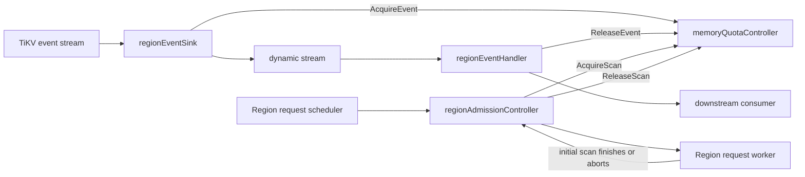
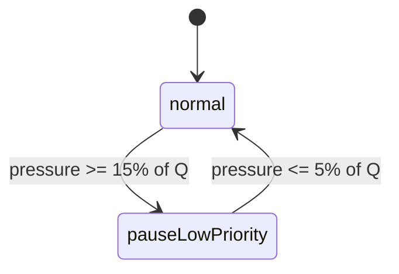

# TiCDC Log Puller Memory Quota Design

This document describes the memory quota mechanism implemented by the
new-architecture Log Puller. The mechanism is owned by
[`memoryQuotaController`](../../logservice/logpuller/memory_quota.go) and is
shared by the Region event receive path and Region initial-scan admission.

Related code includes:

- [`region_event_sink.go`](../../logservice/logpuller/region_event_sink.go):
  accounts entry events before they enter the dynamic stream.
- [`region_event_handler.go`](../../logservice/logpuller/region_event_handler.go):
  releases event memory after downstream consumption or event drop.
- [`region_admission_controller.go`](../../logservice/logpuller/region_admission_controller.go):
  acquires and releases estimated initial-scan memory.
- [`scan_priority.go`](../../logservice/logpuller/scan_priority.go): determines
  whether a Region scan has high or low priority.
- [`pkg/config/debug.go`](../../pkg/config/debug.go): defines the Log Puller
  memory quota configuration.
- [`pkg/metrics/log_puller.go`](../../pkg/metrics/log_puller.go): defines the
  quota metrics.

## 1. Background

The Log Puller has two sources of memory pressure:

1. TiKV entry events that have been received but are still retained by the Log
   Puller or its downstream consumer.
2. Region initial scans that have been admitted but have not yet completed.

The first source is measurable after an event arrives. The second must be
controlled before data arrives, so it is represented by a memory estimate.
Controlling only one source is insufficient:

- Limiting only buffered events reacts too late when many initial scans start
  concurrently.
- Limiting only initial scans does not protect the process when downstream
  consumption stalls and received events remain retained for a long time.

The controller therefore combines event accounting with scan admission while
keeping their hot paths and wake-up conditions separate.

## 2. Goals and non-goals

The design has the following goals:

1. Bound the growth of retained Region entry events when downstream is slow.
2. Reduce the number of new low-priority initial scans before event memory
   reaches the receive-path hard limit.
3. Preserve progress for high-priority recovery and caught-up workloads.
4. Keep event accounting inexpensive because it runs once per received entry
   batch.
5. Wake blocked goroutines without lost notifications during release,
   cancellation, or subscription shutdown.
6. Make ownership explicit so every successful acquisition has exactly one
   release path.

The mechanism is not intended to:

- Measure the complete Go heap or process RSS.
- Enforce a strict upper bound equal to the configured soft quota.
- Provide a separate quota or fairness policy for each subscription.
- Reclaim events or cancel active scans when pressure increases.
- Replace the Region request window maintained by each request worker.

## 3. Architecture

One `subscriptionClient` creates one `memoryQuotaController` and shares it with
the event sink and all Region request workers.



The controller tracks two values:

| Value | Meaning | Accounting model |
| --- | --- | --- |
| `used` | Bytes retained by received entry events. | Estimated from the actual event batch after it arrives. |
| `scanUsed` | Predicted bytes for admitted, unfinished initial scans. | Reserved before a scan starts and released when it finishes or aborts. |

The combined pressure is:

```text
pressure = max(used, scanUsed)
```

The values are deliberately not added. `scanUsed` predicts event memory that
an initial scan may produce, while `used` measures that memory after events
arrive. Adding them would increasingly count the same pressure twice while a
scan is producing events.

## 4. Configuration and thresholds

The settings are under the server debug puller configuration:

```toml
[debug.puller]
memory-quota = 1073741824
scan-base-size = 8388608
```

| Setting | Default | Meaning |
| --- | ---: | --- |
| `memory-quota` | 1 GiB | Local soft capacity, denoted by `Q`. |
| `scan-base-size` | 8 MiB | Base estimate for one admitted initial scan, denoted by `B`. |

Zero values are replaced by these defaults during configuration validation.
The following thresholds are derived internally:

| Threshold | Value | Purpose |
| --- | ---: | --- |
| Pause low-priority scans | `ceil(0.15 * Q)` | Enter scan throttling early. |
| Resume low-priority scans | `floor(0.05 * Q)` | Resume with hysteresis. |
| Event receive hard limit | `2 * Q` | Block additional entry events. |
| Maximum scan estimate | `16 * B` | Bound one scan's predicted charge. |

With the defaults, low-priority scan admission pauses around 153.6 MiB,
resumes around 51.2 MiB, and event receiving blocks around 2 GiB.

`memory-quota` is called a soft capacity because high-priority scans may pass
the scan gate and already-owned event memory is not discarded. The receive
hard limit is a separate safety threshold rather than the value exported as
the configured quota.

## 5. Event memory accounting

### 5.1 What is accounted

Only Region events containing TiKV entries acquire event memory. Resolved-ts
events and Region error notifications do not.

For an entry event, `regionEvent.getSize()` estimates:

- The `regionEvent` value.
- Entry wrapper structures.
- Every row structure.
- Key, value, and old-value byte slices.
- The slice of Region state pointers.

This is an accounting estimate, not a heap profiler. It intentionally does not
include every allocator, runtime, dynamic-stream, or downstream data-structure
overhead.

### 5.2 Acquisition and the hard limit

`regionEventSink.Push()` calls `AcquireEvent()` before pushing an entry event
into the dynamic stream. Below the hard limit, acquisition uses an atomic
compare-and-swap loop and takes no mutex.

For current usage `U`, batch size `E`, and hard limit `H = 2Q`:

```text
U == 0                         -> admit E
U > 0 and U + E <= H           -> admit E
U > 0 and U + E > H            -> wait
```

The empty-controller exception allows one oversized event batch to make
progress even when that batch alone is larger than the hard limit. Without it,
such a batch could never be admitted. Consequently, the hard limit is a
backpressure point, not an absolute maximum.

If admission cannot proceed, the receiver waits until one of these conditions
is true:

- Event memory is released and the acquisition retry succeeds.
- The subscription is stopped.
- The subscription client context is canceled.

While waiting, `AcquireEvent()` returns `false` when it observes either of the
latter two cases, and the event is not pushed into the dynamic stream. The
uncontended fast path checks context cancellation but does not inspect the span
state; normal Region deregistration prevents stopped spans from continuing to
produce events.

### 5.3 Ownership and release

A successful event acquisition remains owned until one of these terminal
paths releases it:

| Path | Release point |
| --- | --- |
| Dynamic stream drops the event | `regionEventHandler.OnDrop()` |
| Downstream consumes asynchronously | The downstream wake callback, after the KV event cache is cleared and resolved-ts is advanced |
| Downstream does not retain the batch | Immediately after synchronous handling |
| Entry event produces no retained KV events | At the end of handler processing |

When several dynamic-stream events are handled as a batch, their
`memoryBytes` values are summed and released together. Stopping a subscription
does not erase already-owned memory; the normal drop, callback, or handler path
still performs the release.

### 5.4 Event waiter notification

Event receivers use a close-and-replace channel protocol:

1. A receiver registers itself as a waiter.
2. It loads the current `ready` channel under the notifier mutex.
3. It retries acquisition and checks whether the span has stopped.
4. Only then does it block on `ready` or context cancellation.

`ReleaseEvent()` closes the current channel and installs a new one for future
waiters. The retry after registration prevents a release immediately before or
during registration from becoming a lost wake-up. An atomic waiter count is
only a fast-path hint used to avoid unnecessary broadcasts.

## 6. Initial-scan admission

### 6.1 Scan estimate

An initial scan reserves estimated memory before the Region request is sent.
For base size `B` and resolved-ts lag `L`, the estimate is:

```text
lagFactor = min(16, 1 + 0.22 * log2(1 + L / 10 minutes))
estimate  = clamp(B * lagFactor, B, 16 * B)
```

The logarithmic factor gives older scans a larger charge without allowing one
Region to monopolize the entire quota. A scan with no positive lag is charged
`B`; the maximum charge is `16B`.

The estimate is predictive. It is not adjusted to match the exact bytes later
received from that Region.

### 6.2 Priority and admission states

The scan priority policy marks a Region HIGH when any of these conditions is
true:

- The request inherited HIGH priority from an earlier attempt.
- The Region resolved-ts is within the configured old-start-ts lag threshold.
- The subscribed span has caught up once; this state is sticky across later
  retries.

Other scans are LOW priority. Priority is also sent to TiKV/CSE and controls
the local Region request queue and request-worker window.

The memory quota controller has two admission states:

| State | LOW priority | HIGH priority |
| --- | --- | --- |
| `normal` | Admitted | Admitted |
| `pauseLowPriority` | Waits on `scanReady` | Admitted |

The transition rules use `pressure = max(used, scanUsed)`:



Hysteresis prevents scans from repeatedly stopping and starting around one
threshold. HIGH priority scans are an escape path: they remain eligible while
LOW priority backlog is paused, subject to the request worker's maximum
window.

Admission is decided using pressure before adding the new scan estimate. This
allows one LOW priority scan to cross the pause threshold and make progress;
subsequent LOW priority scans wait. HIGH priority scans can continue increasing
`scanUsed` beyond the soft threshold.

### 6.3 Interaction with the Region request window

Memory admission is applied after the per-worker Region request window check.
Both conditions must allow a scan:

1. The worker must have an available ordinary or maximum-window slot.
2. The global memory quota must admit the scan.

LOW priority requests use the ordinary window. HIGH priority requests can use
the larger window configured by `region-request-max-window-multiplier` and also
bypass `pauseLowPriority`. These two controls serve different purposes: the
window bounds per-worker concurrency, while the quota coordinates memory
pressure across all workers.

### 6.4 Scan lease lifecycle

Successful admission returns a byte charge stored in a `regionReq` lease. The
lease is released when:

- The Region emits its initialization completion event.
- The request is canceled because the subscription stopped.
- The store stream fails or exits.
- Another request cleanup path aborts the scan.

`finish()` and `abort()` share an atomic compare-and-swap, so concurrent cleanup
paths release the scan estimate and request-window slot exactly once.

If a queued task belongs to an already-stopped span, `AcquireScan()` admits it
with a zero-byte lease. This lets the task reach the normal stopped-request
cleanup path without consuming quota or remaining blocked forever.

### 6.5 Scan waiter notification

Rejected scans wait on the current `scanReady` channel. The controller closes
and replaces this channel when a transition can make scans eligible:

- Event usage falls far enough to change `pauseLowPriority` to `normal`.
- Releasing a scan estimate changes the state to `normal`.
- Subscription stop or client shutdown explicitly calls `WakeAll()`.

The waiting admission loop always rechecks the worker window, span state, and
memory state after waking. The channel is a broadcast signal, not a reservation
for a particular worker.

## 7. Shutdown and cancellation

Stopping a subscription first marks its span as stopped and then calls
`WakeAll()`:

- Blocked event receivers wake and recheck acquisition, cancellation, and the
  stopped span state.
- Blocked scan admissions wake and receive a zero-byte lease for cleanup.

Closing the event sink also calls `WakeAll()` so receivers can observe context
cancellation. Wake-up does not release memory on behalf of an owner. Existing
event and scan charges remain until their corresponding drop, callback,
finish, or abort path runs.

This separation is important: notification changes scheduling, while release
changes accounting.

## 8. Concurrency model and invariants

The implementation separates synchronization by access frequency:

| State | Synchronization |
| --- | --- |
| Event `used` | `atomic.Uint64` and compare-and-swap |
| Event waiter count | Atomic counter |
| Event ready channel | `eventMemoryNotifier.mu` |
| Scan usage, admission level, and ready channel | `scanMu` |
| Scan waiter count | Atomic counter |
| Per-worker pending queue and inflight window | `regionAdmissionController.state` mutex |

The main invariants are:

1. Every successful nonzero acquisition has one terminal release.
2. `used` changes only through `AcquireEvent()` and `ReleaseEvent()`.
3. `scanUsed` changes only while holding `scanMu`.
4. A `regionReq` releases its scan charge and worker slot at most once.
5. Waiters recheck their predicate after registration and after every wake-up.
6. Notifications never transfer ownership and do not imply successful
   admission.
7. Stopping a span wakes blocked work but does not invalidate ownership already
   handed to downstream code.

## 9. Observability

The subscription client updates quota metrics every ten seconds.

| Metric | Meaning |
| --- | --- |
| `ticdc_log_puller_memory_quota{type="max"}` | Configured soft capacity `Q`. |
| `ticdc_log_puller_memory_quota{type="used"}` | Accounted retained event bytes. |
| `ticdc_log_puller_memory_quota{type="scan_estimated"}` | Estimated bytes reserved by active initial scans. |
| `ticdc_log_puller_memory_quota_event_waiter_count` | Event receivers currently waiting at the hard limit. |
| `ticdc_log_puller_memory_quota_scan_waiter_count` | Region scans currently waiting at the scan gate. |
| `ticdc_log_puller_memory_quota_event_wait_duration` | Event receive wait duration histogram. |
| `ticdc_log_puller_memory_quota_scan_wait_duration` | Scan admission wait duration histogram. |

The Grafana dashboards expose three panels:

- **Memory Quota** for logpuller quota values from
  `ticdc_log_puller_memory_quota`. For compatibility, the panel also reads the
  legacy log-puller series from `ticdc_dynamic_stream_memory_usage`.
- **Memory Quota Waiters** for current event and scan waiters.
- **Memory Quota Wait Duration** for average and P99 wait latency.

Operationally:

- Rising `scan_estimated` followed by scan waiters means LOW priority initial scans
  are being intentionally paced.
- Rising `used` with event waiters means downstream retention has reached the
  receive hard limit.
- Persistent HIGH `scan_estimated` without scan waiters can be expected when active
  requests are HIGH priority, because they bypass the soft scan gate.

## 10. Limitations and trade-offs

### 10.1 Approximate rather than exact accounting

Event size is estimated from selected Go structures and payload bytes, and
scan memory is predicted from lag. The metrics should be interpreted as Log
Puller quota state, not exact heap usage.

### 10.2 Progress over a strict cap

One oversized event can enter an empty controller, and HIGH priority scans can
continue above the soft quota. These exceptions avoid deadlock and protect
recovery progress, at the cost of allowing temporary overshoot.

### 10.3 Global rather than per-subscription fairness

All subscriptions using the client share the controller. The design protects
the Log Puller as a whole but does not reserve memory for a particular
subscription or prevent one active workload from consuming most of the
accounted memory.

### 10.4 Predictive and actual pressure overlap

Using `max(used, scanUsed)` avoids double counting, but it is intentionally
conservative in only one dimension at a time. If scan estimates and retained
events represent unrelated workloads, their combined real memory can be
higher than the reported pressure. The separate event hard limit remains the
last receive-path backpressure point.

### 10.5 No forced reclamation

The controller blocks new work and waits for current owners to release memory.
It does not discard downstream-owned events or revoke active scan leases. This
keeps ownership and correctness simple, but recovery depends on the downstream
callback and request cleanup paths continuing to run.
