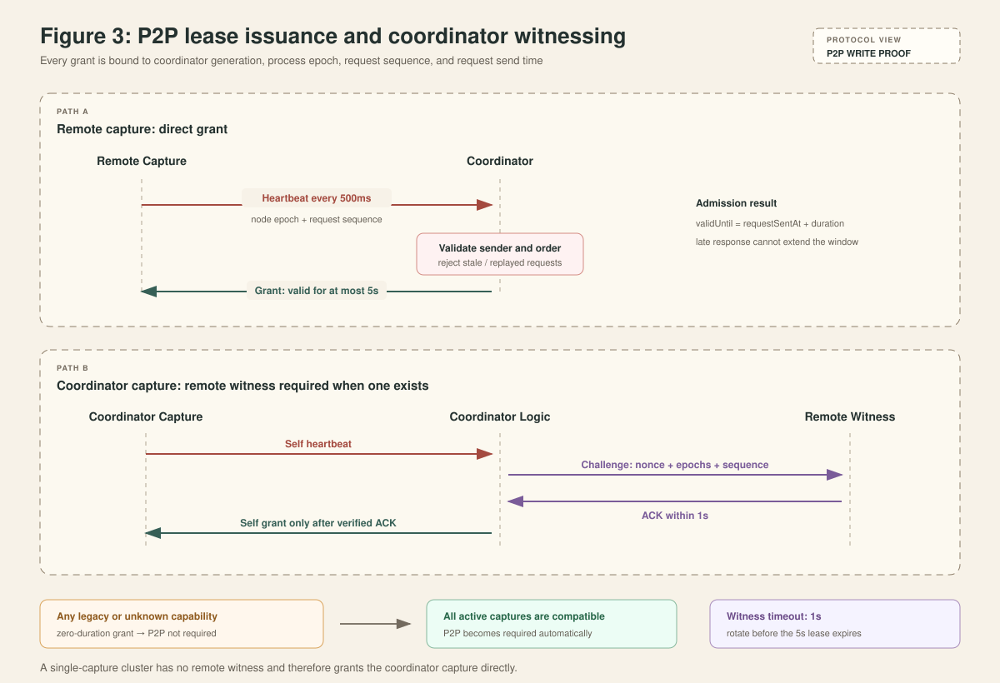
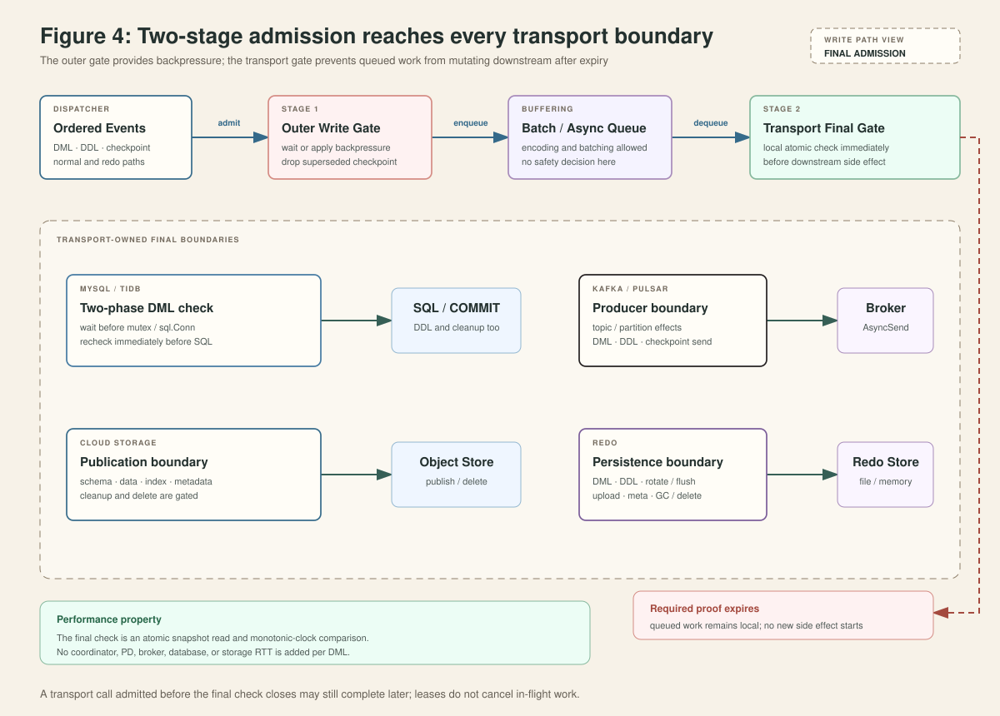
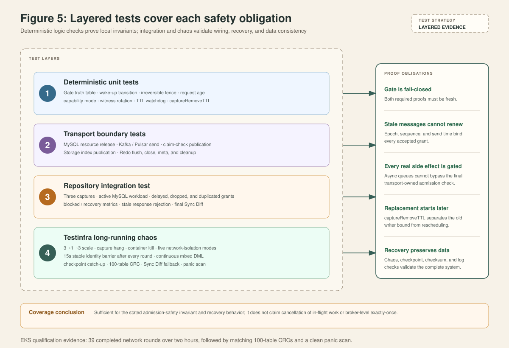

# TiCDC Capture Write Lease Detailed Design

> This document describes the complete capture write-lease design, its
> implementation boundaries, safety proof, failure behavior, observability,
> and test coverage. It is intended for TiCDC developers, reviewers, and test
> engineers and does not require another design document as prerequisite
> reading.

## 1. Goals and boundaries

### 1.1 Problem statement

A TiCDC capture may lose connectivity to PD, the coordinator, or other
captures while retaining access to a downstream system. If the scheduler has
already created a replacement and the disconnected capture continues writing,
two writers can create side effects against the same downstream state.

This design establishes a capture-wide write-admission condition with the
following goal:

> After an old capture loses proof of identity or proof that it is managed by
> the coordinator, it stops starting new downstream side effects within a
> bounded interval. A replacement can take over only after a later boundary.

### 1.2 Guarantees

- All sinks stop starting new downstream side effects when the P2P lease or
  etcd write proof required by the current mode expires.
- P2P faults and temporary etcd TTL query failures cause recoverable write
  blocking rather than immediate capture termination.
- A confirmed loss of the etcd session irreversibly fences the capture and
  terminates the process.
- After capture-key deletion, `captureRemoveTTL` delays scheduler-visible node
  removal so a replacement cannot take over too early.
- During a rolling upgrade, P2P is required only after every active capture
  has reported support for the protocol.
- Normal writes perform only a local atomic state read and do not add a
  per-write coordinator, PD, or downstream network round trip.

### 1.3 Non-goals

- The gate does not cancel SQL, producer sends, or object uploads that passed
  the final admission check before the gate closed.
- The design does not add a downstream fencing token and does not claim strict
  exactly-once delivery.
- It does not change TiCDC's existing retry and duplicate-delivery semantics
  for an already committed event.
- A single-capture cluster has no remote witness. In that topology P2P cannot
  prove external connectivity, so safety primarily relies on the etcd proof.

## 2. System model and core invariant

Each capture creates one local `writelease.Gate`. The gate combines the
following state:

```text
p2pValidUntil       // local deadline of the P2P grant
etcdProofValidUntil // local deadline derived from the existing etcd session
p2pRequired         // whether the current cluster mode requires P2P
fenced              // whether this process irreversibly lost its identity
```

There is one write-admission predicate:

```text
writeAllowed(now) =
    !fenced
    AND now < etcdProofValidUntil
    AND (!p2pRequired OR now < p2pValidUntil)
```

The etcd proof is therefore always required. Whether the P2P proof is required
is negotiated from the capabilities of all active captures. Unknown state is
fail-closed, and a newly created gate starts closed.


The proofs have separate responsibilities:

| State or proof | What it proves | Effect of expiry | Recovery |
| --- | --- | --- | --- |
| P2P lease | The capture is managed by the current coordinator generation. | Stop new writes while the process remains alive. | Accept a valid new grant. |
| etcd write proof | The capture's existing etcd session identity can still be confirmed. | Stop new writes while TTL queries continue. | Receive a successful positive TTL response. |
| Local fence | The session is confirmed lost. | Permanently close the gate, stop local write paths, and terminate. | Start a new process. |

## 3. Safety ordering and proof

`captureRemoveTTL` is the scheduling barrier for a replacement. Define:

```text
Le   = maximum etcd proof lifetime = 5s
R    = captureRemoveTTL = max(captureSessionTTL / 2, 10s)
td   = time the old capture key is deleted in a linearizable etcd view
tobs = time another CDC node observes that deletion, tobs >= td
```

For any TTL query that returns a positive TTL, its linearization point precedes
`td`, and its `requestSentAt` is no later than that linearization point. The
proof begins at `requestSentAt` and lasts at most `Le`, so:

```text
oldLastAdmission < td + Le = td + 5s
```

Another node does not publish node removal immediately after observing the key
deletion. It first waits `R`:

```text
newFirstAdmission >= tobs + R >= td + 10s
```

With default values:

```text
oldLastAdmission < td + 5s < td + 10s <= tobs + R <= newFirstAdmission
```


This proves that the new-operation admission windows do not overlap. P2P
usually stops the old writer sooner, but the proof does not depend on P2P.
Mixed-version and single-capture modes therefore retain the same time-separation
lower bound.

The proof depends on four implementation conditions:

1. Every real downstream side effect passes through a transport-owned final
   gate.
2. Every replacement is produced through the same scheduling path that
   observes capture removal.
3. Capture-key deletion and observation follow etcd linearizability.
4. In-process deadline comparison uses Go's monotonic clock, which advances
   normally for the process.

## 4. P2P lease design

### 4.1 Heartbeats and grants

Every bootstrapped capture sends a node heartbeat every 500 ms. A request
contains:

- A non-zero `nodeEpoch` for the current process lifetime.
- A monotonically increasing `writeLeaseRequestSeq`.
- The current write-lease protocol version.
- An optional witness ACK.

The coordinator processes heartbeats only from initialized nodes. For each
capture, it records the process epoch and largest observed sequence. It does
not issue a grant for an epoch change, a repeated or decreasing sequence, a
stopping node, or a protocol mismatch.

The capture validates a response before accepting it:

```text
sender == currentCoordinator
coordinatorVersion == currentCoordinatorVersion
targetNodeEpoch == localNodeEpoch
requestSeq exists in local outstanding requests
requestSeq > lastAppliedLeaseSeq
duration <= 5s
```

The local deadline is derived from the request send time:

```text
p2pValidUntil = requestSentAt + grantDuration
```

A five-second grant arriving after seven seconds is already expired and cannot
reopen the gate. A duplicate response is rejected because its sequence has
already been applied.



### 4.2 Coordinator and capture on different nodes

A remote capture heartbeat already represents cross-node communication. After
validating the request, the coordinator directly returns a grant lasting at
most five seconds. If either the request or response direction is broken, the
existing grant expires within five seconds.

A remote heartbeat does not require scanning the complete initialized-node
list. The coordinator performs one `NodeInitialized` check for the sender, so
the ordinary heartbeat path is O(1).

### 4.3 Coordinator and capture on the same node

Local messaging cannot prove that the coordinator host is still connected to
the rest of the cluster. Whenever a remote capture exists, the coordinator's
own capture must first complete a remote witness challenge:

```text
self heartbeat
    -> coordinator selects a remote initialized witness
    -> challenge(coordinatorVersion, selfEpoch, selfSeq, witnessEpoch, nonce)
    -> witness echoes an ACK in its heartbeat
    -> coordinator validates every field and grants its local capture
```

One challenge attempt times out after one second, while a P2P lease lasts up to
five seconds. If a witness becomes unreachable, the coordinator rotates to
another witness in stable order without allowing one failed attempt to consume
the complete lease interval.

Only a heartbeat from the coordinator's own capture needs cluster membership
for witness selection. In that path, the bootstrapper acquires its lock once
and creates one initialized-node snapshot. This retains the required
membership information without turning every high-frequency heartbeat into an
O(N) scan and creating O(N^2) control-plane work.

### 4.4 Single-capture cluster

When no remote capture exists, the coordinator's local capture receives a
direct grant. This keeps single-node deployments available, but P2P cannot
prove external connectivity in that topology. The etcd proof remains
mandatory, and etcd proof plus `captureRemoveTTL` still establishes the
replacement ordering.

### 4.5 Rolling upgrades and capability negotiation

Every bootstrap response declares its supported write-lease protocol version.
The coordinator recomputes the cluster mode when:

- A node joins.
- A node leaves.
- A bootstrap response arrives with capability information.

The rule is:

```text
if any active capture is legacy or capability is unknown:
    p2pLeaseEnabled = false
    return a validated zero-duration grant
else:
    p2pLeaseEnabled = true
    return a normal grant up to 5s
```

After accepting a zero-duration grant, a capture sets `p2pRequired=false`; the
etcd proof remains required. Once every active capture reports compatible
capability, later grants carry a positive duration and captures set
`p2pRequired=true`. No coordinator restart is needed.

When the coordinator generation changes, a capture immediately invalidates its
existing P2P proof and clears outstanding requests. A delayed response from the
previous coordinator cannot renew the new generation.

## 5. etcd write proof and process termination

### 5.1 Why the design does not create a second etcd lease

The capture registration key is already attached to the real etcd session
lease. Creating another `LeaseID` would introduce two keepalive streams, two
failure semantics, and ambiguity about whether the identity lease or write
lease represents a live capture.

The design reuses the existing session and maintains only one in-process
deadline:

```text
etcdProofValidUntil
```

This is not another etcd lease and does not create a new key. It represents how
long the process may still trust the latest verified positive session TTL.

### 5.2 TTL query and proof calculation

The server queries the existing session `LeaseID` once per second. A request
has a maximum timeout of three seconds. If the current proof has less time
remaining, the request timeout is shortened to that remaining time so a
blocked query cannot cross the local safety deadline.

After a successful TTL query:

```text
proofDuration = min(5s, reportedTTL - 1s)
etcdProofValidUntil = requestSentAt + proofDuration
```

Three details matter:

- Starting at `requestSentAt` prevents a slow response from adding validity.
- Subtracting a one-second safety margin absorbs whole-second TTL rounding and
  transport delay.
- Capping the proof at five seconds prevents a larger session TTL from
  extending the old writer's stop-write bound.

A failed query, timeout, nil response, or `TTL == 0` does not renew the proof
and does not independently terminate the process. Once the proof expires, the
gate becomes non-writable. A later positive TTL response can recover it.

### 5.3 Write blocking versus process exit

```text
P2P expired              -> block new writes; keep process alive
etcd proof expired       -> block new writes; keep querying TTL
TTL query error          -> do not renew; keep process alive
Session.Done()           -> irreversible local fence; exit
confirmed TTL < 0        -> irreversible local fence; exit
```

After local fencing, the server:

1. Marks the gate `fenced`. This state is irreversible for the process.
2. Advances node liveness to draining and then stopping.
3. Tells `DispatcherOrchestrator` and all dispatcher managers to stop local
   write paths.
4. Returns a capture-suicide error, cancels module contexts, and exits.

`TTL == 0` is not confirmation that the lease was deleted, so it only allows
the proof to expire naturally. Only `TTL < 0` or `Session.Done()` is exit
evidence.

## 6. Gate concurrency and performance

The gate publishes an immutable `leaseState` through an `atomic.Pointer`. A
write path only performs:

```text
state = atomicLoad()
compare monotonic deadlines
```

Renewals, mode changes, and fencing use one short mutex to serialize state
publication. They perform no network access on the write path.

### 6.1 Waiting and notification

A blocked writer waits on the `changed` channel. The channel is closed and
replaced only when the combined state changes from non-writable to writable:

```text
becameWritable = !writable(oldState, now) AND writable(newState, now)
if becameWritable:
    close(changed)
    changed = new channel
```

For example, renewing the etcd proof while the required P2P lease is still
expired does not wake every writer for a futile retry. During an outage this
reduces wake-ups from "every proof update times the waiter count" to one
broadcast when admission actually recovers.

### 6.2 State reasons

The gate exposes five states for metrics and transition logs:

```text
writable
p2p_expired
etcd_proof_expired
both_expired
fenced
```

`fenced` has the highest priority. No later renewal can reopen the gate.

## 7. Gate injection and final write boundaries

The server creates one capture-wide gate and publishes it through app context
to dispatcher managers, ordinary sinks, and redo sinks. `Sink.SetWriteGate` is
a mandatory interface method for every sink.

Admission is checked in two stages:

1. The outer `writeGatedSink` waits before an event enters the sink. This
   provides backpressure and reduces unnecessary queue growth.
2. Each transport checks again immediately before the operation that creates
   the real downstream side effect. This closes the asynchronous-queue gap.



### 7.1 Common outer gate

- **DML:** waits while non-writable instead of sending more events into the
  sink.
- **DDL, sync point, and block events:** waits for admission and verifies it
  again before invoking the underlying sink.
- **Checkpoint:** skips the current checkpoint while blocked because a later,
  larger checkpoint supersedes it. This avoids blocking a periodic message
  stream.

The outer gate is not the final safety boundary because work may already be in
a producer, encoder, or file-writer queue. The transport checks below provide
the final guarantee.

### 7.2 MySQL and TiDB

DML uses a two-phase check:

```text
loop:
    wait for Gate outside withConn
    acquire session mutex and sql.Conn
    if Gate is closed immediately before SQL:
        close/release connection
        release mutex
        continue
    execute transaction
```

Writers do not occupy dedicated connections while the lease is unavailable,
and a non-blocking final check remains immediately before SQL. DDL, sync-point
operations, DDL-ts updates, and `RemoveDDLTsItem` cleanup use the same gate, so
changefeed deletion cannot bypass admission and mutate TiCDC downstream
metadata.

### 7.3 Kafka

The final check covers:

- Topic and partition side effects.
- Every DML `AsyncSend`.
- DDL and checkpoint sends.
- Claim-check object publication for large messages.

An event that has already been encoded or queued cannot start a new producer
send or claim-check object write after the gate closes.

### 7.4 Pulsar

The final check covers topic and partition operations and DML, DDL, and
checkpoint producer sends. Pulsar's asynchronous queue cannot bypass the
capture-wide gate.

### 7.5 Cloud Storage

The final check covers schema, data, index, and metadata publication as well
as cleanup and delete operations. Encoded or spooled messages may remain local
while blocked, but cannot start a new object-store mutation. Processing resumes
after the gate reopens.

### 7.6 Redo

The final check covers file and memory writers for DML, DDL, rotate, flush,
upload, metadata updates, and GC/delete. If the gate is closed during writer
shutdown, an unpublished temporary file is not converted into a consumable
final file.

Redo is not the business downstream, but it determines which events are
considered durable during disaster recovery. Concurrent publication of redo
files or metadata by two captures can corrupt that recovery view, so redo must
use the same gate.

### 7.7 Blackhole

Blackhole has no real external side effect, so `SetWriteGate` is a no-op. It
still satisfies the common interface without waiting.

## 8. Role of `captureRemoveTTL`

`captureRemoveTTL` is neither an etcd lease nor the mechanism that terminates
the old process. It delays scheduler-visible node removal after `NodeManager`
observes deletion of a capture key:

```text
captureRemoveTTL = max(captureSessionTTL / 2, 10s)
```

The default `captureSessionTTL` is ten seconds, so the default
`captureRemoveTTL` is ten seconds.

The sequence is:

```text
observe capture key deletion
    -> record pending removal time
    -> keep capture in the node view
    -> wait captureRemoveTTL
    -> publish node removal
    -> scheduler may create a replacement
```

If the same capture ID re-registers during the delay, the pending removal is
canceled. A transient session disturbance therefore does not unnecessarily
trigger failover.

The separation of responsibilities is:

- The local etcd proof establishes the latest time the old writer may admit a
  new operation.
- `captureRemoveTTL` establishes an earliest time when replacement scheduling
  may begin.

P2P improves stop-write latency during isolation, but it is not the replacement
scheduling barrier.

## 9. Failure behavior

| Failure | Gate behavior | Capture exits? | Replacement behavior |
| --- | --- | --- | --- |
| Coordinator response is lost | P2P expires within five seconds and new writes stop. | No. | Capture key remains; no replacement is triggered. |
| Coordinator capture is isolated from other nodes | Witness cannot ACK; local P2P expires. | Only if the etcd session is also confirmed lost. | Depends on capture-key deletion. |
| One witness is unreachable | Rotate after one second; no interruption if another witness succeeds in time. | No. | Not triggered. |
| PD/etcd TTL query temporarily fails | Do not renew etcd proof; stop writes after proof expiry. | No. | Not triggered while the key remains. |
| etcd session is confirmed lost | Irreversible local fence. | Yes. | Wait `captureRemoveTTL` after observing key deletion. |
| Control plane is unreachable but downstream remains reachable | At least one required proof expires and transports stop new writes. | Only after confirmed session loss. | Constrained by `captureRemoveTTL`. |
| A legacy node participates in a rolling upgrade | P2P is not required; etcd proof remains required. | Follows etcd session semantics. | Constrained by `captureRemoveTTL`. |

### 9.1 Complete example

Assume an old writer on CDC-1 has just obtained its final five-second P2P grant
and five-second etcd proof at `t0`. CDC-1 then loses connectivity to both the
coordinator/witness and PD while retaining access to MySQL:

1. From `t0` through `t0+5s`, the final proofs may remain valid, so the old
   writer may still admit transactions.
2. No later than `t0+5s`, the gate closes. No transport starts a new SQL
   operation, send, object publication, or redo flush.
3. Around `t0+10s`, the default session TTL expires and the capture key is
   deleted from etcd.
4. Other nodes observe the deletion and wait the default ten-second
   `captureRemoveTTL`.
5. Only then can the scheduler publish node removal and create a replacement;
   the replacement's first actual write is later still.

The old writer therefore stops new admission by about `t0+5s`, while a
replacement normally cannot write until after `t0+20s`. The boundaries create
an explicit separation interval.

### 9.2 Late completion remains possible

Consider this MySQL sequence:

```text
t1: old writer passes the final Gate check
t2: old writer sends COMMIT
t3: Gate closes
t4: replacement starts after the removal barrier
t5: the delayed old COMMIT finally reaches MySQL
```

The lease cannot cancel the `COMMIT` sent at `t2`. A Kafka/Pulsar send or object
upload that already started can also finish after the gate closes. The design
prevents new operations from starting after closure; it does not guarantee
that every old operation completes before replacement activity.

Eliminating this tail risk requires a downstream writer epoch/fencing token or
an abort/drain protocol with a proven hard completion bound.

## 10. Observability

The design exposes these primary metrics:

| Metric | Meaning |
| --- | --- |
| `ticdc_server_capture_write_gate_state{state}` | One-hot gauge for the five gate states. |
| `ticdc_server_capture_p2p_lease_remaining_seconds` | Remaining P2P lease lifetime. |
| `ticdc_server_capture_etcd_proof_remaining_seconds` | Remaining etcd proof lifetime. |
| `ticdc_server_capture_write_block_total{reason}` | Number of writable-to-blocked transitions by reason. |
| `ticdc_server_capture_last_write_admission_timestamp_seconds` | Time of the most recent admitted downstream operation. |
| `ticdc_server_capture_lease_response_rejected_total{reason}` | Rejections by sender, epoch, sequence, duration, and other validation reasons. |
| `ticdc_coordinator_capture_lease_heartbeat_total{result}` | Coordinator heartbeat-processing results. |
| `ticdc_server_capture_lease_response_total{result}` | Capture response-processing results. |
| `ticdc_coordinator_capture_p2p_witness_available` | Whether a remote witness is available for the coordinator capture. |
| `ticdc_server_capture_safe_to_reschedule_delay_seconds` | Effective `captureRemoveTTL`. |

A writable-to-blocked transition logs its reason, and a blocked-to-writable
transition logs recovery. Local fencing has a separate explicit log, allowing
operators to distinguish recoverable write blocking from process termination
after confirmed identity loss.

## 11. Test design and coverage

Testing is layered. Each layer validates a different proof obligation rather
than relying on one end-to-end result to infer every concurrency boundary.



### 11.1 Deterministic gate, protocol, and removal tests

Tests in `pkg/writelease` cover:

- The two-proof truth table and fail-closed initial state.
- Rejection of late renewals and irreversible fencing.
- Context cancellation.
- Notification only on a non-writable-to-writable transition.
- Coordinator negotiation that enables or disables P2P.
- Compatibility behavior when no gate is installed.

Coordinator and maintainer tests cover:

- Direct grants to remote captures.
- The remote-witness requirement for the coordinator capture.
- Single-capture fallback.
- Witness rotation after one second and recovery within the five-second lease.
- Mode transitions caused by legacy, unknown, or fully compatible membership
  and by node joins and removals.
- Rejection of invalid heartbeats, epoch mismatches, late witness ACKs, and
  replayed or unknown sequences.
- Bootstrap capability, zero-duration and positive-duration grants, and the
  witness challenge/ACK path.

Server and orchestrator tests cover:

- Fencing on `Session.Done()` and `TTL < 0`.
- No false process termination on `TTL == 0` or TTL query error.
- Positive-TTL renewal and request timeout bounded by the current proof
  deadline.
- Gate state and block-transition metrics.
- `captureRemoveTTL` calculation, delayed removal, and cancellation of pending
  removal when the same capture re-registers.

Messaging tests include in-process and remote serialization round trips for
the response and witness fields, ensuring that the protocol works through the
real message path rather than only through direct function calls.

### 11.2 Transport boundary tests

Tests close the gate at the actual side-effect API and verify that the lower
level mock or file operation does not occur:

| Transport | Primary coverage |
| --- | --- |
| Common sink wrapper | DML block/recovery, context cancellation, and all DDL/checkpoint write entries. |
| MySQL | Waiting before SQL, connection release after a failed final check, shutdown rejection, and gated DDL-ts cleanup. |
| Kafka | Blocked DML send; the same gate on DDL/checkpoint/topic paths; no claim-check object publication. |
| Pulsar | Blocked DDL send and common-gate use by DML and checkpoint producer paths. |
| Cloud Storage | Waiting before index publication and gate injection into schema, data, metadata, and cleanup paths. |
| Redo | Gated file flush, close publication, memory DDL, metadata flush, and cleanup while preserving local-file semantics. |

Because `Sink.SetWriteGate` is mandatory, a new sink that omits gate injection
fails at compile time. Component tests then verify that the gate reaches the
transport's actual mutation point.

### 11.3 Repository integration case

[`tests/integration_tests/capture_write_lease`](../../tests/integration_tests/capture_write_lease)
runs three captures with continuous MySQL INSERT and UPDATE traffic. Failpoints
inject three coordinator-to-capture grant failures:

1. Delay a response beyond five seconds and verify `p2p_expired`.
2. Drop grants in one direction while heartbeats still reach the coordinator,
   proving that one-way control-plane loss also stops writes.
3. Replay a response and verify that `unknown_sequence` or
   `replayed_sequence` increases without reopening the gate.

During a failure the case verifies that:

- All three CDC processes remain alive, because P2P expiry must not terminate
  a capture.
- At least one probe table stops replicating, demonstrating that write
  admission actually closed.
- After fault removal the same capture returns to `writable` and drains the
  backlog.
- Final probe row counts are complete, YCSB produced both INSERT and UPDATE
  traffic, and Sync Diff reports consistency.

The same integration case also runs baseline synchronization and Sync Diff for
Kafka, Pulsar, and Storage sinks. Lease-response fault assertions are in the
MySQL branch; deterministic component tests own the final-boundary proof for
the asynchronous transports.

### 11.4 Testinfra `cdc_network_chaos_synthetic`

The testinfra case runs three captures, a MySQL sink, and continuous mixed DML.
Its standard long-running manifest uses 100 tables with 100,000 rows each, for
ten million initial rows. Preparation uses 32 workers and committed batches of
1,000 rows. The run phase uses 256 closed-loop workers. Each workload event
issues two UPDATEs, one DELETE, and one INSERT, with each statement committing
independently.

The case has four phases:

1. **Preparation and pressure recovery.** Wait for TiKV memory, scheduler
   throttle, and memtable limiter metrics to recover. Preparation is resumable,
   with a five-minute no-progress deadline and a 45-minute overall limit per
   attempt, for at most three attempts.
2. **Capture lifecycle failures.** Scale TiCDC from three captures to one and
   back to three, hang one capture for ten seconds, and kill one capture
   container. Wait for topology recovery and record the RTO of each operation.
3. **Two-hour network chaos.** Inject ten-second faults with at least two
   minutes after one completed round before the next. Capture ordinals and
   failure modes rotate in stable order:

   - **full ingress:** drop all traffic entering the target capture;
   - **full egress:** drop all traffic leaving the target capture;
   - **full bidirectional:** completely isolate the target capture;
   - **PD-only:** isolate the target capture from PD while keeping MySQL
     reachable;
   - **PD+CDC:** isolate the target capture from PD and the other captures while
     keeping MySQL reachable.

   Full-node modes include the downstream path. Control-plane-only modes run a
   MySQL TCP probe from the isolated capture, directly proving the risky state
   in which the control plane is unavailable but the downstream remains
   reachable. Every round must reach injected, cleanup, and inactive-rule
   recovery. The ordinals and capture IDs of all three captures must then
   remain unchanged for 15 seconds before another fault can start. A
   completion-based timer prevents delayed ticker events from causing
   back-to-back faults.
4. **Final correctness.** Record a TSO after the workload, wait for the CDC
   checkpoint to pass it, compare source and target CRCs for all 100 tables,
   run row-level Sync Diff only for failed tables, and scan all CDC logs for
   panics.

EKS qualification plan `8181081`, case execution `21126582`, completed
successfully in 2 hours 27 minutes 48 seconds. The two-hour network phase
completed 39 rounds: full ingress, full egress, full bidirectional, and PD-only
ran eight times each; PD+CDC ran seven times. Every round completed injection,
cleanup, recovery, and the 15-second identity-stability barrier. All 100 final
table CRCs matched, no failed table required repair, Sync Diff inspection
completed, and the CDC panic scan was clean.

That long-running execution used TiCDC build `c979ed56` and validates the
dual-lease system failure model, capture lifecycle, recovery, and end-to-end
data consistency. Deterministic unit and component tests on implementation
baseline `e4b59cdaa` cover the transport final gates, mixed-version mode, short
witness timeout, and MySQL connection release. These evidence types have
different responsibilities: long-running chaos validates real system
composition and fault shapes, while deterministic tests validate final write
boundaries and concurrency interleavings that are difficult to reproduce
reliably in a cluster.

### 11.5 Why the coverage is sufficient

For the guarantee stated by this design, coverage is sufficient because each
assumption in the proof has direct evidence:

| Proof obligation | Direct evidence |
| --- | --- |
| The gate opens only when every required proof is fresh. | Gate truth-table, deadline, fence, and mode tests. |
| A delayed or replayed message cannot extend a lease. | Epoch, sequence, request-age tests and integration failpoints. |
| Every real side effect checks final admission. | Component tests for five sink types, claim-check, and redo, plus the mandatory sink interface. |
| Replacement does not start immediately after key deletion. | `captureRemoveTTL` state tests and lifecycle chaos. |
| A capture stops and recovers when the control plane is isolated but downstream remains reachable. | PD-only and PD+CDC reachability probes and the two-hour rotation. |
| Recovery leaves no residual data error. | Checkpoint catch-up, 100-table CRC, Sync Diff, and panic scan. |

This evidence supports the claim that no new downstream side effect starts
after the gate closes and that replacement admission follows the old writer's
bounded admission interval. It is not used to claim cancellation of already
admitted work or broker-level exactly-once, neither of which is a design
guarantee.

Before merge or release, the target build should still run the repository
integration case and the long-running testinfra plan. That is a regression
check of binary packaging, deployment, and external dependencies, not a
substitute for a missing safety-proof obligation.

## 12. Key parameters

| Parameter | Value | Purpose |
| --- | --- | --- |
| Node heartbeat interval | 500 ms | Fast renewal and failure detection. |
| P2P lease duration | 5 s | Bound new writes after coordinator loss. |
| Witness attempt timeout | 1 s | Try another witness before the five-second lease expires. |
| etcd TTL watch interval | 1 s | Continuously refresh session-identity proof. |
| etcd TTL request timeout | At most 3 s | Prevent a query from blocking across the proof deadline. |
| etcd TTL safety margin | 1 s | Absorb TTL rounding and transport time. |
| etcd proof duration | At most 5 s | Bound new writes after PD/etcd loss. |
| Capture session TTL | 10 s by default | Server-side lifetime of the capture key. |
| `captureRemoveTTL` | `max(sessionTTL / 2, 10s)` | Establish a later replacement-takeover boundary. |
| Gate monitor interval | 100 ms | Record gate metrics and transition logs. |

## 13. Implementation map

| Responsibility | Code |
| --- | --- |
| Gate state, waiting, renewal, and fencing | [`pkg/writelease/write_gate.go`](../../pkg/writelease/write_gate.go) |
| P2P grants, capabilities, and witnesses | [`coordinator/capture_write_lease.go`](../../coordinator/capture_write_lease.go) |
| Heartbeat admission and initialized-node snapshot | [`coordinator/controller.go`](../../coordinator/controller.go), [`pkg/bootstrap/bootstrap.go`](../../pkg/bootstrap/bootstrap.go) |
| Capture heartbeat, response validation, and witness ACK | [`maintainer/maintainer_manager_node.go`](../../maintainer/maintainer_manager_node.go) |
| Coordinator-generation changes | [`maintainer/maintainer_manager.go`](../../maintainer/maintainer_manager.go) |
| etcd TTL watchdog and local fence | [`server/server.go`](../../server/server.go) |
| Capture-wide gate injection | [`server/server.go`](../../server/server.go), [`pkg/common/context/app_context.go`](../../pkg/common/context/app_context.go) |
| Replacement delay | [`pkg/orchestrator/reactor_state.go`](../../pkg/orchestrator/reactor_state.go) |
| Common outer sink gate | [`downstreamadapter/sink/write_gate.go`](../../downstreamadapter/sink/write_gate.go) |
| Transport final gates | `downstreamadapter/sink/{mysql,kafka,pulsar,cloudstorage,redo}` |
| MySQL final SQL check | [`pkg/sink/mysql`](../../pkg/sink/mysql) |
| Kafka claim-check | [`pkg/sink/kafka/claimcheck`](../../pkg/sink/kafka/claimcheck) |
| Storage schema path | [`pkg/cloudstorage`](../../pkg/cloudstorage) |
| Redo file and memory writers | [`pkg/redo/writer`](../../pkg/redo/writer) |
| Repository integration case | [`tests/integration_tests/capture_write_lease`](../../tests/integration_tests/capture_write_lease) |
| Testinfra case | `caselib/ticdc/testcase/cdc_network_chaos_synthetic.go` in `pingcap/test-infra` |
| Testinfra chaos step | `caselib/pkg/steps/cdc_network_chaos.go` in `pingcap/test-infra` |

## 14. Conclusion

The capture write lease reduces "may this capture still write?" to one local,
low-overhead, fail-closed gate. The P2P lease proves the current coordinator
relationship, the etcd proof confirms the capture session identity, and
`captureRemoveTTL` delays the replacement. Final checks at every real sink
mutation boundary make asynchronous queues obey the same safety condition.

The design proves that the new-write admission windows of the old and
replacement writers do not overlap, and it automatically blocks and recovers
during control-plane faults. Its boundary for already admitted in-flight work
is explicit, so admission fencing is not overstated as downstream exactly-once
delivery.
