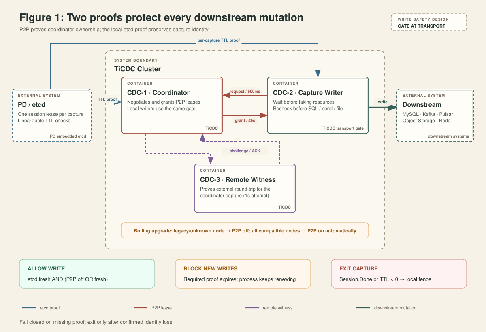
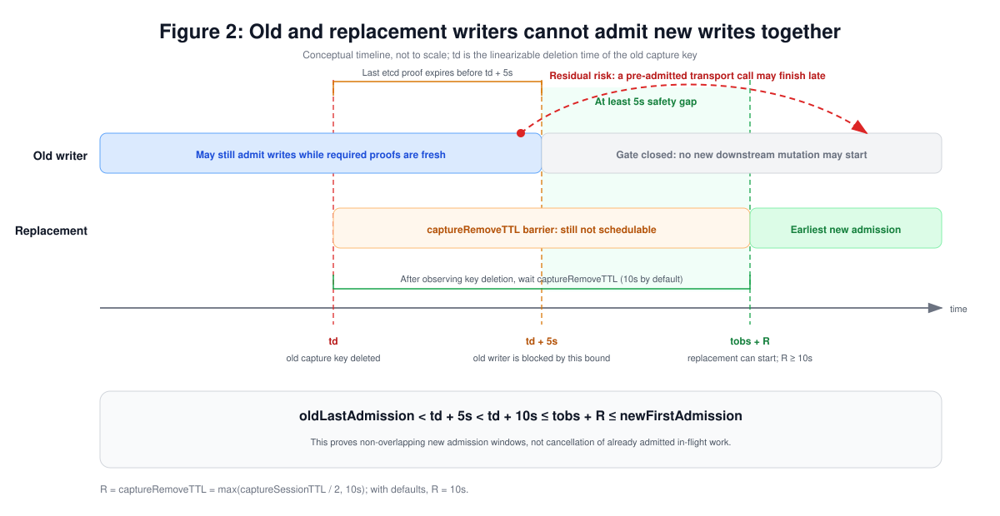

# TiCDC Capture Write Lease: Design Overview and Safety Boundary

> This document is intended for engineering leadership and TiCDC developers.
> It focuses on the overall mechanism, impact, and safety proof while omitting
> protocol fields and function-level details.

## 1. Executive summary

The capture write lease addresses this failure mode: after an old capture loses
contact with the cluster, it must not continue creating new downstream side
effects merely because it can still reach the downstream system. Before a
replacement starts, new-write admission on the old writer must already be
closed.

The design uses one capture-wide local gate and combines two independent
proofs:

- **etcd write proof** proves that the capture's etcd session identity can
  still be confirmed. It is always required.
- **P2P lease** proves that the capture is still managed by the current
  coordinator. It is required only when every active capture supports the
  protocol.

The core decision is:

```text
p2pRequired = allActiveCapturesSupportCurrentProtocol

writeAllowed = !localFenced
               AND etcdProofFresh
               AND (!p2pRequired OR p2pLeaseFresh)
```

If any required proof expires, the gate blocks new downstream side effects,
but the capture remains alive and continues renewing. Only `Session.Done()` or
a successful TTL query that explicitly returns `TTL < 0` triggers an
irreversible local fence and terminates the capture.

During a rolling upgrade, any legacy capture or unknown capability switches the
cluster to etcd-only admission. P2P admission is enabled automatically once all
active captures have reported support. The gate is also enforced at every
sink's actual mutation boundary, so events already present in an asynchronous
queue cannot proceed to SQL execution, producer send, object publication, or
redo persistence after lease expiry.



## 2. Responsibilities of the two proofs

### P2P lease: prove management by the current coordinator

Every capture sends a heartbeat to the coordinator every 500 ms. Each request
contains a process epoch and a monotonically increasing sequence number. A
valid grant lasts at most five seconds and is measured from the request send
time. A delayed or replayed response cannot extend the lease.

The grant path depends on where the coordinator runs:

| Deployment | P2P renewal | Purpose |
| --- | --- | --- |
| Coordinator and capture are on different nodes | The coordinator validates the heartbeat and directly returns a grant. | A broken request or response direction stops new writes within five seconds. |
| Coordinator and capture are on the same node, with a remote capture available | The coordinator must complete a challenge/ACK with a remote witness before granting its local capture. | Prevents local in-process messaging from incorrectly renewing a node that is externally isolated. |
| Single-capture cluster | No remote witness exists, so the local capture receives a direct grant. | P2P does not prove external connectivity; safety relies primarily on the etcd proof. |

One witness attempt times out after one second, while the P2P lease lasts five
seconds. If a witness becomes unreachable, the coordinator still has time to
try another witness before the local lease expires.

P2P expiry only **blocks new writes**. The capture, dispatchers, and control
plane continue running. A fresh valid grant reopens the gate. P2P expiry by
itself neither removes the capture key nor schedules a replacement.

### etcd write proof: prove that the capture identity is still valid

At startup, each capture uses one real etcd session lease to register its
capture key. The default session TTL is ten seconds. The design does not create
a second etcd `LeaseID`; it maintains only a local
`etcdProofValidUntil` deadline.

The server queries the existing session lease TTL once per second. A successful
positive TTL response extends the local proof as follows:

```text
proofDuration = min(5s, reportedTTL - 1s)
etcdProofValidUntil = requestSentAt + proofDuration
```

The proof starts at the request send time rather than the response arrival time,
so a slow response cannot create extra validity. A failed query, timeout, or
empty response does not renew the proof. When the proof expires, the gate stops
writes but the capture keeps querying; a later positive TTL can recover the
gate.

Write blocking and process exit are intentionally different:

```text
TTL query failed / proof expired  -> block new writes, keep running
Session.Done or confirmed TTL < 0 -> local fence, stop write paths, exit
```

This makes write admission conservative without terminating a capture on a
single transient etcd query failure.

## 3. Downstream effects controlled by the gate

`Sink.SetWriteGate` is a mandatory sink contract. An outer gate provides
backpressure before an event enters a sink, and every transport performs a
second check immediately before its real downstream side effect:

| Write path | Final gate location | Behavior while blocked |
| --- | --- | --- |
| MySQL / TiDB | DML waits before acquiring the session mutex and `sql.Conn`, then rechecks immediately before SQL. DDL, sync points, and DDL-ts cleanup use the same gate. | Waiting does not occupy a connection. A failed final check releases the connection and mutex before retrying. |
| Kafka | Before topic/partition effects, every `AsyncSend`, DDL/checkpoint send, and claim-check object publication. | Encoded or queued events stop at the producer boundary. A blocked checkpoint is skipped because a later value supersedes it. |
| Pulsar | Before topic/partition effects and DML, DDL, or checkpoint producer sends. | Asynchronously queued events cannot bypass the gate. |
| Cloud Storage | Before publishing schema, data, index, or metadata files and before cleanup/delete operations. | Buffered events remain local, but no new object write or deletion starts. |
| Redo | Before file/memory DML and DDL persistence, rotate/flush/upload, metadata updates, and GC/delete. | No new redo persistence or cleanup operation starts. |

Blackhole has no external side effect, so its gate injection is intentionally a
no-op.

The transport-level check matters because an entry gate only decides whether an
event may enter an asynchronous queue. The transport gate decides whether work
already in that queue may still touch the downstream system. The final check is
a local atomic state load, so it does not add a coordinator, PD, or downstream
network round trip to each DML operation.

Waiters are notified only when the combined state changes from non-writable to
writable. Renewing one proof while another required proof remains expired does
not wake every writer for a futile retry.

## 4. Rolling-upgrade compatibility

Each capture reports its write-lease capability in the bootstrap response. The
coordinator recomputes the cluster mode whenever a node joins, a node leaves,
or a bootstrap response arrives:

```text
Any legacy or capability-unknown active capture:
    P2P disabled for the whole cluster
    etcd proof remains mandatory

All active captures support the protocol:
    P2P enabled automatically
    writes require both P2P and etcd proof
```

When P2P is disabled, the coordinator returns an authenticated,
epoch-and-sequence-validated zero-duration grant. The capture interprets it as
`p2pRequired = false`. A coordinator upgraded before the other captures
therefore does not permanently block its local changefeeds, and the cluster
switches to dual-proof admission automatically after all captures are ready.

The safety implication is explicit: while legacy captures are present, the
cluster does not have P2P isolation protection. Admission safety relies on the
etcd proof and `captureRemoveTTL` until all active captures support P2P.

## 5. `captureRemoveTTL` and replacement admission

`captureRemoveTTL` is not an etcd lease and does not control when the old
process exits. It is the delay between another CDC node observing deletion of a
capture key and publishing that capture's removal to schedulers:

```text
captureRemoveTTL = max(captureSessionTTL / 2, 10s)
```

With the default `captureSessionTTL = 10s`, `captureRemoveTTL = 10s`. During
this delay:

- The old capture remains in the node view and is not immediately replaced.
- A re-registration of the same capture cancels the pending removal.
- Only after the delay expires is node removal published, after which a
  replacement may be scheduled.

The local proof creates an upper bound for when the old writer stops admitting
new work. `captureRemoveTTL` creates a later lower bound for when a replacement
can begin.

## 6. Why new-write admission does not overlap

Define:

```text
Le   = maximum local etcd proof lifetime = 5s
R    = captureRemoveTTL                  >= 10s
td   = linearizable deletion time of the old capture key
tobs = time another CDC node observes the deletion, tobs >= td
```

The request send time for the last positive TTL proof precedes `td`, and the
proof lasts at most five seconds:

```text
oldEtcdProofValidUntil < td + 5s
oldLastAdmission       < td + 5s
```

A replacement must wait `R` after observing the deletion:

```text
newFirstAdmission >= tobs + R >= td + 10s
```

Therefore:

```text
oldLastAdmission < td + 5s < td + 10s <= tobs + R <= newFirstAdmission
```



The proof depends on four conditions: every real downstream side effect passes
through a transport gate; all replacements pass through `captureRemoveTTL`;
capture-key deletion is observed with etcd linearizability; and the local
monotonic clock advances normally. MySQL, Kafka, Pulsar, Cloud Storage, and Redo
all implement the same gate contract, so asynchronous queues are not an
unbounded gap in the proof.

### Example

Assume an old writer has just obtained its final P2P and etcd proofs at `t0`,
then loses both coordinator/witness and PD/etcd connectivity while retaining
access to the downstream system:

1. Between `t0` and `t0+5s`, the final proofs may remain valid and the old
   writer may still admit new operations.
2. No later than `t0+5s`, the gate closes and no transport starts a new SQL
   operation, send, file publication, or metadata mutation.
3. With defaults, the session lease expires around `t0+10s` and the capture key
   is deleted.
4. Other nodes observe the deletion and wait another ten seconds before
   publishing node removal and scheduling a replacement.
5. The replacement's first actual write is normally later than `t0+20s`, about
   fifteen seconds after the old writer stopped admitting new operations.

Detection and scheduling may add wall-clock delay, but they cannot reverse the
ordering established by the inequalities above.

## 7. Residual risk

The lease prevents an operation from **starting after the gate closes**. It
cannot cancel an operation that passed the final check before closure. For
example:

1. The old writer passes the final check and sends a MySQL `COMMIT`.
2. The gate closes, preventing new transactions.
3. The `COMMIT` remains delayed in a proxy or the network.
4. A replacement begins writing after the removal barrier.
5. The delayed old `COMMIT` finally reaches MySQL.

The same boundary applies to a Kafka/Pulsar send or object upload that already
started. The design proves non-overlapping **new-admission windows**; it does
not prove strict exactly-once or cancellation of admitted in-flight work.

Eliminating that tail risk requires a downstream fencing token/epoch,
idempotent transactional protocol, or a drain/abort mechanism with a hard
completion bound. Those approaches are outside the design goal of avoiding
downstream protocol changes and per-write network RTTs.

## 8. Implementation entry points

- Gate and proof state: [`pkg/writelease/write_gate.go`](../../pkg/writelease/write_gate.go)
- etcd TTL watchdog and local fence: [`server/server.go`](../../server/server.go)
- P2P, mixed-version mode, and witness: [`coordinator/capture_write_lease.go`](../../coordinator/capture_write_lease.go)
- Capture heartbeat and capability handling: [`maintainer/maintainer_manager_node.go`](../../maintainer/maintainer_manager_node.go)
- Replacement barrier: [`pkg/orchestrator/reactor_state.go`](../../pkg/orchestrator/reactor_state.go)
- Common sink gate: [`downstreamadapter/sink/write_gate.go`](../../downstreamadapter/sink/write_gate.go)
- Transport-owned final checks: `downstreamadapter/sink/{mysql,kafka,pulsar,cloudstorage,redo}`,
  `pkg/sink/mysql`, and `pkg/redo/writer`

Protocol fields, state transitions, transport boundaries, and the complete
test strategy are described in the
[detailed design](./capture-write-lease-design.md).
